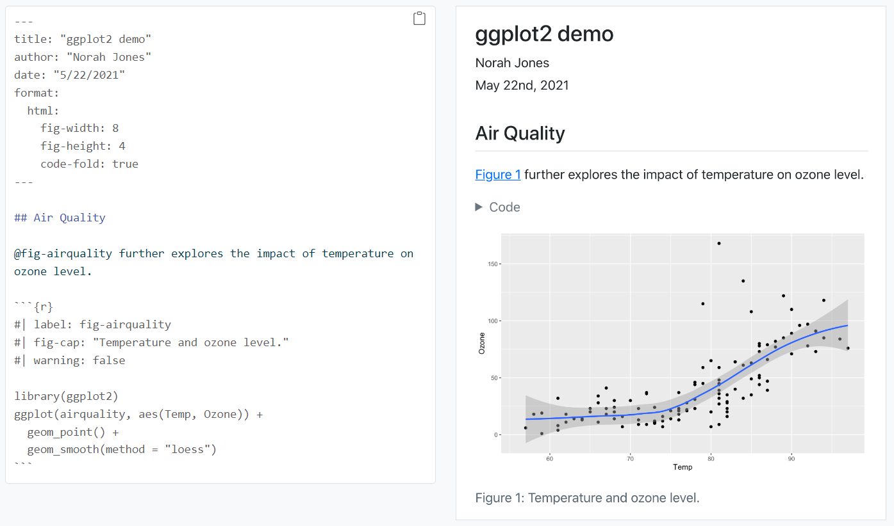
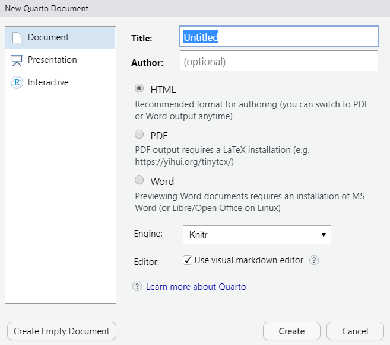
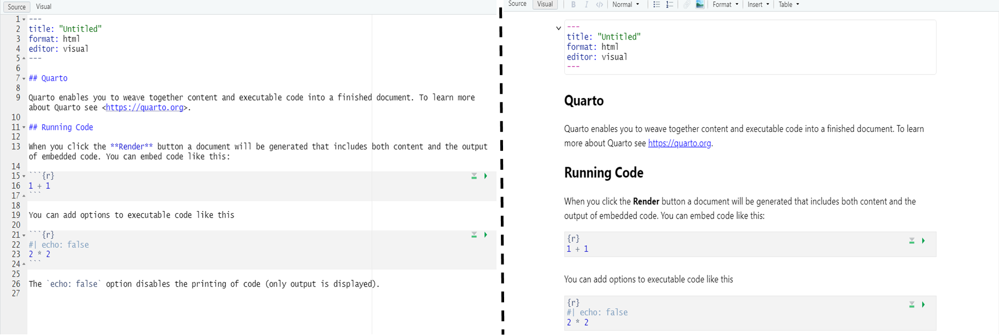

## 1 Today's program

-   Introduction to Open Science & Reproducibility
-   Quarto basics
-   New assignment

## 2 Today's Learning Objectives

-   List benefits of using Quarto to create reports
-   Explain how Quarto is a useful tool in Open Science approaches
-   Learn Quarto basic

## 3 Introduction

### 3.1 What can reproducibility do for you ?

First, read @markowetz2015 and get to understand the five reason to use reproducibility in your R project.

1.  Reproducibility helps to avoid disaster;

2.  reproducibility makes it easier to write papers;

3.  Reproducibility enables continuity of your work;

4.  Reproducibility helps reviewers see it your way;

5.  Reproducibility helps to build your reputation.

### 3.2 Why Open Science

Open science in a nutshell is about making scientific methods, data and outcomes available to everyone. It can be broken down into several parts [@gezelter2015], including:

-   Transparency in experimental methodology, observation, and collection of data
-   Public availability and reusability of scientific data
-   Public accessibility and transparency of scientific communication
-   Using web-based tools to facilitate scientific collaboration

We are not going to cover all aspects of open science as listed above. However, you will learn one tool that can be used to make your workflows:

-   More transparent
-   More available and accessible to the public and your colleagues

In this tutorial, you will learn how to document your work - by connecting data, methods and outputs in one or more reports or documents. You will learn the Quarto file format which can be used to generate reports that connect your data, code (methods used to process the data) and outputs. You will use the Quarto and `Render` package to write Quarto files in Rstudio and publish them in different formats (html, pdf, Word, etc).

## 4 Quarto

Quarto is an open-source scientific and technical publishing system that allows to create dynamic content with **R, Python , Julia and Observable.**

It allows you to publish reproducible, production quality articles, presentations, dashboards, websites, blogs, and books in HTML, PDF, MS Word, ePub, and more. If you want to learn more about [Quarto](https://quarto.org/).

Simply put, `.qmd` is a text based file format that allows you to include both descriptive text, code blocks and code output. You can run the code in R and using a package called `Render` (which you will learn about next) you can export the text formate`.qmd` file to a nicely rendered, shareable format like pdf or html. When you render (or use `Render`) the code is run and so your code outputs including plots, and other figures appear in the rendered document.

Quarto is the upgrade of Rmarkdown. If you were working with Rmarkdown, don't worry the transition is easy and painless ! Indeed you can past your code from a `.rmd` file to a `.qmd` file directly and it will work. So why Quarto rather than Markdown ? Same than Cyber punk 2077, the latest version is commonly better.

You use Quarto(.`qmd)` files to document workflows and to share data processing, analysis and visualization code & outputs.

### 4.1 Why Quarto

There are many advantages to using R Markdown in your work:

-   **Human readable**: it's much easier to read a web page or a report containing text and figures.
-   **Simple syntax**: Markdown and .qmd can be learned quickly. A Reminder for Your Future Self All components of your work are clearly documented. You don't have to remember what steps, assumptions, tests were used.
-   **Easy to Modify**: you can easily extend or refine analyses by modifying existing or adding new code blocks.
-   **Flexible export formats**: analysis results can be disseminated in various formats including html, pdf, slide shows and more.
-   **Easy to share**: code and data can be shared with a colleague to replicate the workflow.

### 4.2 Quarto is beneficial to your colleagues

The link between data, code and results make `.qmd` powerful. You can share your entire workflow with your colleagues and they can quickly see your process. You can also write reports using `.qmd` files which contain code and data analysis results. To enrich the document, you can add text, just like you would in a word document that describes your workflow, discusses your results and presents your conclusions - along side your analysis results

### 4.3 Quarto is beneficial to you & your future self

**Quarto** as a format is an efficient tool. If you need to make changes to your workflow, you can simply modify the report and re-render (or `render`) the report. This creates an efficient workflow. Your future self will appreciate it too. Quarto provides documentation for you to see what code you used to create a figure or to analyze the data.

### 4.4 Use render to convert .qmd to .html

You use the R `knitr` package to render your markdown and create easy to read documents from `.qmd` files. You will learn how to use `knitr` later in this lesson.



Quarto script (left) and the HTML produced from the render Quarto script (right).

## 5 How to create an Quarto File in R and the Quarto file structure

### 5.1 Create Your .qmd File

Now that you see how `Quarto` can be used in RStudio, you are ready to create your own `.qmd` document. Do the following:

1.  Create a new Quarto document and choose html as the desired output format. You can later use Quarto to create Word or pdf documentation.
2.  Enter a Title (Advanced Geo-Processing QMD test) and Author Name (your name). Then click OK.
3.  Hit the Knit HTML drop down button in RStudio (as is done in the video above). What happens?

{fig-align="center" width="500"}

If everything went well, you should have an `html` format (web page) output after you hit the render button. Note that this html output is built from a combination of code and text documentation that was written using markdown/Quarto syntax.

Next, let's break down the structure of an `Quarto` file.

### 5.2 The structure of an Quarto File

Quarto enables you to weave together content and executable code into a finished document. To learn more about Quarto see <https://quarto.org>. Basically, Quarto works with two interfaces :

1.  The Source editor where lives the codes behind your document
2.  The Visual editor (a [WYSIWYG](https://en.wikipedia.org/wiki/WYSIWYG) interface)

I recommend you to work exclusively with the **visual** interface rather than the **source**. This interface is working with the same patterns than an Word document but with the opportunity to make computation of code lines and get the result directly.



**There are three parts to an `.qmd`file**

**1. Header**: The text at the top of the document, written in YAML format.

**2. Markdown sections** : Text that describes your workflow written using markdown syntax.

**3. Code chunks**: Chunks of R code that can be run and also can be rendered using `render` to an output document.

Next, let's break down each of the parts listed above.

**YAML Header (front matter)**

An `Quarto` file always starts with a header written using [YAML](https://en.wikipedia.org/wiki/YAML%20syntax). This header is sometimes referred to as the front matter.

There are four default elements in the RStudio `YAML` header:

-   title: the title of your document. Note, this is not the same as the file name.
-   author: who wrote the document.
-   date: by default this is the date that the file is created.
-   output: what format will the output be in. You will use html.

When you click the **Render** button a document will be generated that includes both content and the output of embedded code. Before using it, it is nice to define several parameters in your Html document

Indeed to make your document more interesting you can add several parameters to improve the clarity and style of your html.

``` yaml
---
title: "Session 4 : open sciences"
format: html
theme: zephyr
toc: true
toc-depth: 5
number-sections: true
standalone: true
embed-resources: true
editor: visual
execute:
  echo: false
  warning: false
  error: false
---
```

**Don't forget these parameters :** the following options are indispensable if you want to share your work with others people.

-   `standalone` and `embed-ressources` must be `TRUE` if you want to share your html only and not the Quarto document (`.qmd`). You will notice that Quarto is creating folders on your computer with results and images used in the document. But when you share an html, people do not have this external dependency. Using those parameters will create a document without links to your directory.

-   `toc` and its options ( `toc-depth,toc-title,toc-location`,...) will create an interactive *Table of Content* for the users of your document. It will enhance clarity and used of your document.

**Go further parameters :** the following options are not mandatory but it will enhance the visual aspect of your document :

-   `execute` options are used to define which kind of results of your chunks will appear in the html. Be careful it will be applied to all your chunks in your code ! However if you want that some chunks do not follow those parameters you can write the inverse option in the chunk ( e.g `{r, echo =true, warning=true, error = false})`

    -   `warning = False` will hide every warning messages of your code.

    -   `error = False`

    -   `echo = False` will hide your chunks and only the results will appear on your document. It is very useful if the code is just a tool and you don't need to explain it.

-   `theme` is an option to define the font of your document, you can define it as your own taste but don't forget that sobriety is a good think even if some themes such as `vapor` (Cyberpunk style) are really cool. Have a look on the options [here](https://quarto.org/docs/output-formats/html-themes.html).

-   If you want to justify your document, you can define it under the front matter using this code line in the **source interface !!** Here the option `eval = false` will not run the code, it is useful if you just want to show your code for explanation or if it does not work.

    ```{r, eval=FALSE}
    <style>
    body {
    text-align: justify}
    </style>
    ```

::: callout-tip
While the YAML header configures a single document, a special file named `_quarto.yml` sets options for the **entire project**.

When you render any `.qmd` file, Quarto looks for a `_quarto.yml` in the same folder or parent folders. If it finds one, it uses the settings defined there as defaults for all documents. This is the perfect place to define shared options like the project title, theme, and execution settings.
:::

**Quarto text & Quarto blocks**

The second part of a Quarto document is the markdown itself which is used to add documentation to your file (or write your report).

**Quarto syntax in .qmd Files**

An Quarto file can contain text written using the markdown syntax. Quarto text, can be whatever you want. It may describe the data that you are using, how it's being processed and what the outputs are. You may even add some text that interprets or discusses the outputs.

When you render your document to html, this Quarto will appear as text on the output html document. We cover the basic syntax of Quarto.

### 5.3 Quarto syntax

#### 5.3.1 Section headings

If you want to have a better structure in your document, it is always relevant to use **section headings**. More than making your document prettier, it is also directly linked to your interactive *Table Of Content (TOC for friends and family)*. When your HTML is ready, the **section headings** will allow users to go to any point in your document by clicking on the headings section of their choice.

You can clic on the `Normal` menu in the head and select **section headings** of your choice.

{#fig-headings}

Or you can use the shortcuts `ctrl+alt+1` (1 to 6 subsections in total) to make something like this.

# Main Menu

## 1.Subsection

### 1.1 Let's go deeper

#### 1.1.1 Metaverse is waiting for you

##### 1.1.1.1 Create your own structure !

###### 1.1.1.1.1 Linked to your TOC ;)

#### 5.3.2 Quarto is the New Word

This corresponds to the following code (in source mode)

```{r, eval = FALSE}
# Main Menu

## 1.Subsection

### 1.1 Let's go deeper

#### 1.1.1 Metaverse is waiting for you

##### 1.1.1.1 Create your own structure !

###### 1.1.1.1.1 Linked to your TOC ;)
```

When you type text in a Quarto document with not additional syntax, the text will appear as paragraph text. You can add additional syntax to that text to format it in different ways.

For example if you want to write specifics words in *italic* or in **bold** you can select the relative symbol in the head menu of your document. Or by using the `Format` menu where you can define several parameters.

But you can also learn the shortcut to be faster (Be carefull, shortcuts could be differents regarding language and type of computer)!

-   `ctrl` + `i` : to write your text in *italic*

-   `ctrl` + `b` : to write your text in **bold**

-   `ctrl` + `d`: to highlight a `function` or some `code` within a plain text paragraph.

Through the head menu you can also insert basic bullet points and number list to structure your document. To further designs, go through the `Format` menu and have some fun 🤩

1.  So

2.  Nice

As in a word document you can ask it to check your spelling or find specific words with `ctrl` + `f` where you can replace them one by one or all in the same time. Useful if you noticed that you have write tuberculiosis in your all document instead of *tuberculosis* (#TrueStory)

**Insert and table**

Just as in a Word document, you can `insert` multiples contains in your document just by going through the head menu.

You can insert **figures** with caption, define their size and position in your document. You can directly paste it in your document if you want !

](https://cdn.futura-sciences.com/buildsv6/images/wide1920/8/5/8/85876892f7_132257_prim-holstein.jpg){fig-align="center"}

You can also add external links to internet resources, such as references to your document, complementary information or even videos such as [How Quarto is an extension of Rmardown ?](https://www.youtube.com/watch?v=GIqpYO4xinc).

In source mode, you can of course (cross-reference)\[https://quarto.org/docs/authoring/cross-references.html\] objects too!

For instance, I can refer to @fig-headings using `{#fig-headings}`. The presence of the label `{#fig-headings}` make it cross-referencable. Then I can refer to it in my document using `@fig-headings`

To add an internet link to a piece of text, use `[my text](https://someurl.org)`

You can draw tables too:

|    Names     | First names |
|:------------:|:-----------:|
|   Dagobert   |    Leny     |
|    Sprite    | Maximilien  |
|  Froussard   |   Marine    |
| Dequenlelard |   Tyrion    |

Table 1 - Exemple of Table

Which corresponds in source mode to:

```{r, eval = FALSE}
|    Names     | First names |
|:------------:|:-----------:|
|   Dagobert   |    Leny     |
|    Sprite    | Maximilien  |
|  Froussard   |   Marine    |
| Dequenlelard |   Tyrion    |
```

Quarto supports also bibliography files in a wide variety of formats including BibLaTeX. Add a bibliography to your document using the bibliography YAML metadata field. For example:

``` plaintext
---
title: "My Document"
bibliography: references.bib
---
```

Then inside Quarto, use the standard Pandoc markdown representation for citations (e.g. `[@lovelace_geocomputation_2025]` will give [@lovelace_geocomputation_2025], and `@lovelace_geocomputation_2025` gives @lovelace_geocomputation_2025). At the end, the document will automatically make a bibliography with all your references. Look [here](https://quarto.org/docs/authoring/citations.html) for more information.

#### 5.3.3 Code chunks

There we go to the most electrifying part of Quarto, insertion of **code chunks**! Code chunks in an R Quarto document contain your R code that can be entirely run using the *Green arrow* (not [him](https://www.google.com/search?sca_esv=1a30264c0409ca1f&rlz=1C1GCEA_enBE1027BE1027&sxsrf=ACQVn0-zatisO0MWjB-AqpI72twtncuxAg:1708699589229&q=green+arrow&tbm=isch&source=lnms&sa=X&sqi=2&ved=2ahUKEwiYuqyA2sGEAxUG7AIHHVtQDnkQ0pQJegQIDRAB&biw=1396&bih=632&dpr=1.38)). If you want to run all the **code chunks** above this one, you can use the symbol next to it. You can add a chunk using `ctrl+alt+i`. Be careful to always have the `{r}` in your chunk !

```{r}
#Green arrow will run this chunk
#Next to it will run all chunks above
```

Write the following code in a code chunk: `library(ggplot2)` `qplot(speed, dist, data=cars) + geom_smooth()`. This should give you this output:

```{r}
library(ggplot2)
qplot(speed, dist, data=cars) + geom_smooth()
```

Three common code chunk options are:

-   `eval = FALSE`: Do not evaluate (or run) this code chunk when knitting the Quarto document. The code in this chunk will still render in our knitted html output, however it will not be evaluated or run by R. It is useful when you have error in your chunk but you still want to share your document.

    ```{r, eval=FALSE}
    data<-means()
    ```

-   `echo = FALSE`: Hide the code in the output. The code is evaluated when the Quarto file is render, however only the output is rendered on the output document. It is great if you want to write an output document such as report and article without showing code lines.

-   `include = FALSE`: The code chunk will be evaluated but the results or the code will not be rendered on the output document. This is useful if you are viewing the structure of a large object (e.g., outputs of a large data.frame which is the equivalent of a spreadsheet in R).

    ```{r,results='hide'}
    library(ggplot2)
    qplot(speed, dist, data=cars) + geom_smooth()
    ```

Multiple code chunk options can be used for the same chunk.

It is recommended to set default for these options at the very beginning of your Quarto document and only overwrite those when necessary. Concretely you could insert a chunk like:

```{r setup, include=TRUE, warning=FALSE}
knitr::opts_chunk$set(
    echo = TRUE,
    message = FALSE,
    warning = FALSE
)
```

You would typically don't want to show this this chunk in your final output, you would use the option `include = FALSE` to hide it.

::: callout-warning
When you render a Quarto document, code chunks run with a *working directory*. This affects how **relative paths** (like `data/myfile.csv`) are resolved.

You can control this with `execute-dir`:

-   **`execute-dir: project`** (recommended for reproducibility): all chunks run from the **Quarto project root** (the folder that contains `_quarto.yml`). Then paths like `data/...`, `images/...`, etc. are consistent across all `.qmd` files in the project.
-   **`execute-dir: file`**: chunks run from the **folder that contains the current `.qmd` file**. This can be convenient, but relative paths may change when you move a file or render a different document.

You can set it globally in the project `_quarto.yml` (applies to all documents) or set it per-document in the YAML front matter of a `.qmd`
:::

::: assignment
# Assignment

Create a basic Quarto file and a HTML report for your project where you define :

-   Your purpose for this project.

-   Your primary workflow for your project. It is suggest that you include a nice figure which describe your work.

-   A Table of content to create a dynamic document.

-   Optional: Chunks where you download data and make first data treatment.

This assignment must be a small inch to start your project, it must not be perfect but just helps you to define your purpose and get used to work in a Quarto/Markdown file.
:::
