Hello World 31b8e172-b470-440e-83d8-e6b185028602:dAB5AHAAZQA6AFoAUQBBAHgAQQBEAGcAQQBNAFEAQQA1AEEARABZAEEATQBBAEEAMQBBAEMAMABBAE0AQQBCAGgAQQBHAE0AQQBaAEEAQQB0AEEARABRAEEAWgBnAEIAaABBAEcAVQBBAEwAUQBBADQAQQBHAEkAQQBPAFEAQQA1AEEAQwAwAEEATwBRAEIAagBBAEQARQBBAFkAZwBBADMAQQBHAEkAQQBaAEEAQQAzAEEARwBNAEEATQBBAEIAbQBBAEQARQBBAAoAcABvAHMAaQB0AGkAbwBuADoATQBRAEEAeQBBAEEAPQA9AAoAcAByAGUAZgBpAHgAOgAKAHMAbwB1AHIAYwBlADoATABRAEEAdABBAEMAMABBAEMAZwBCADAAQQBHAGsAQQBkAEEAQgBzAEEARwBVAEEATwBnAEEAZwBBAEMASQBBAFQAQQBCAEgAQQBFAFUAQQBUAHcAQQB5AEEARABFAEEATwBBAEEAMQBBAEQAbwBBAEkAQQBCAEoAQQBHADQAQQBkAEEAQgB5AEEARwA4AEEAWgBBAEIAMQBBAEcATQBBAGQAQQBCAHAAQQBHADgAQQBiAGcAQQBnAEEASABRAEEAYgB3AEEAZwBBAEUAYwBBAGEAUQBCADAAQQBDAEEAQQBKAGcAQQBnAEEARQBjAEEAYQBRAEIAMABBAEcAZwBBAGQAUQBCAGkAQQBDAEkAQQBDAGcAQgBoAEEASABVAEEAZABBAEIAbwBBAEcAOABBAGMAZwBBADYAQQBDAEEAQQBJAGcAQgBMAEEASABJAEEAYQBRAEIAegBBAEgAUQBBAGIAdwBCAG0AQQBDAEEAQQBWAGcAQgBoAEEARwA0AEEASQBBAEIAUABBAEcAOABBAGMAdwBCADAAQQBDAHcAQQBJAEEAQgBCAEEARwA0AEEAZABBAEIAdgBBAEcAawBBAGIAZwBCAGwAQQBDAEEAQQBVAHcAQgAwAEEARwBVAEEAZABnAEIAbABBAEcANABBAGMAdwBBAGcAQQBDAFkAQQBJAEEAQgBXAEEARwBFAEEAYgBBAEIAbABBAEcANABBAGQAQQBCAHAAQQBHADQAQQBJAEEAQgBEAEEARwBnAEEAWQBRAEIAeQBBAEcAdwBBAGEAUQBCAGwAQQBIAEkAQQBJAGcAQQBLAEEARQBRAEEAWQBRAEIAMABBAEcAVQBBAE8AZwBBAGcAQQBEAEkAQQBNAEEAQQB5AEEARABZAEEATABRAEEAdwBBAEQATQBBAEwAUQBBAHcAQQBEAFEAQQBDAGcAQQB0AEEAQwAwAEEATABRAEEAPQAKAHMAdQBmAGYAaQB4ADoA:31b8e172-b470-440e-83d8-e6b185028602

# Learning Objectives

-   **Understand** the basics of Git

-   **Setup** your machine

-   **Apply** simple version control workflows

------------------------------------------------------------------------

# Resources

-   [Happy Git and GitHub for the useR](https://happygitwithr.com/)
-   [Reproducible workflow and version control with Git and Github](https://jules32.github.io/2016-07-12-Oxford/git/)
-   [git/github guide a minimal tutorial](https://kbroman.org/github_tutorial/)
-   [Version Control with Git](https://swcarpentry.github.io/git-novice/)
-   [RWorkflow Intro to Git](https://rverse-tutorials.github.io/RWorkflow/intro-git.html#Git_(GitHubGitLab))
-   [LGEO2185 GitHub repository](https://github.com/UCLouvain-GEOG/LGEO2185/)

------------------------------------------------------------------------

# 1. Introduction

## 1.1 Version control & collaboration

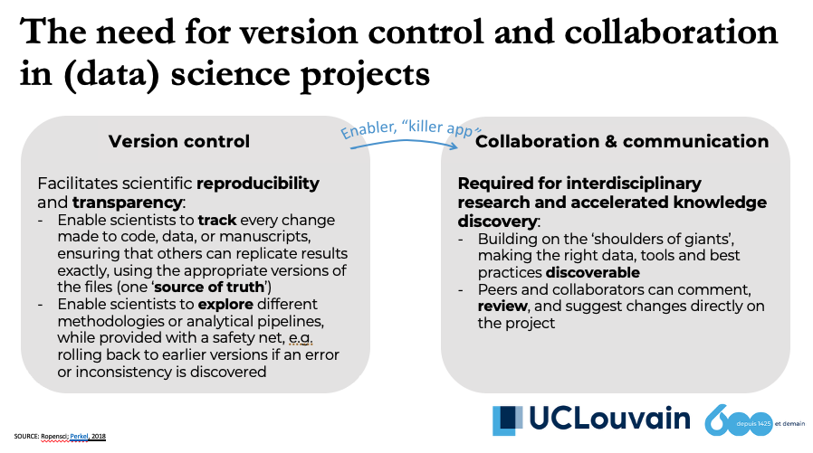

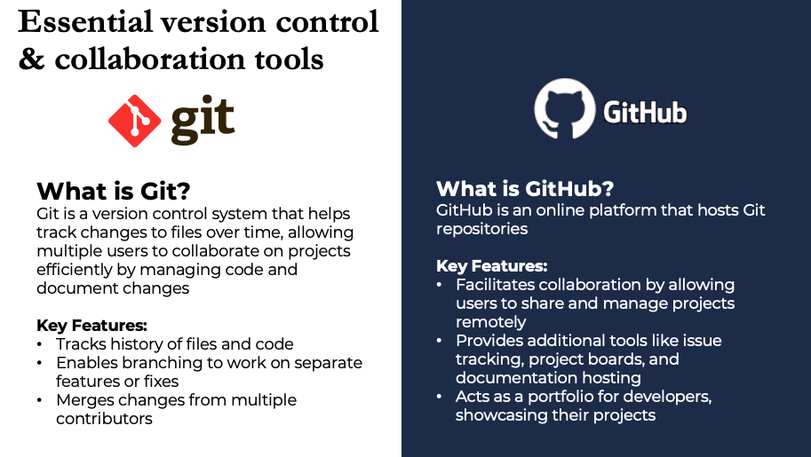

::: callout-tip
Git isn’t specific to programming – it can version control any text-based files (manuscripts, data scripts, etc.). How many of us have manually tried to keep track of versions? Git prevents the chaos of files like `analysis_final_v2.R`. Git automates that process and maintains a complete history…

Read [Version Control with Git Lesson 1](https://swcarpentry.github.io/git-novice/01-basics.html) to see how Git addresses questions like *"what if an older version was better?"*, *"how can I share code?"*, and *"how can I collaborate?"*
:::

------------------------------------------------------------------------

## 1.2 Basic vocabulary & mental model

### Git language basics

-   Git stores a project inside a **repository** (often shortened to “repo”). It contains both the files under version control and a hidden metadata folder that stores the full history of changes, configuration data, and branching information. A repository can exist entirely on a local machine. This means you can use Git for tracking versions without any connection to an online service.
-   Git history is made of **commits** (snapshots). A commit is a recorded snapshot of the staged changes. Each commit includes information such as the author, timestamp, and a descriptive message. Commits are the building blocks of a project's version history. Once committed, a change is stored permanently in the repository and can be referenced, compared, or reverted at any time.
-   The term “**HEAD**” refers to the current position in the commit history. It represents the most recent commit that is checked out in the working directory. When new commits are made, **HEAD** moves forward to reference the latest version. It acts as Git's internal pointer for tracking which part of the project a user is currently working on.
-   A **diff** is a comparison between the current version of the file and the last committed version. This view highlights exactly what has changed, line by line
-   A **remote** is another copy of the repo, typically on GitHub
-   A **branch** is a parallel line of development within a Git repository. It allows users to isolate different lines of work — such as new features, experimental code, or bug fixes — from the main project history. Branches are independent from each other until changes are explicitly merged. This supports safe experimentation and collaborative workflows, where each contributor can work independently.
-   A **merge** combines branches. Merging is the process of integrating changes from one branch into another. It combines the histories and contents of two branches into a single branch. Merging is typically used to incorporate a feature or set of changes into the main project history after it has been tested and reviewed.
-   A **conflict** can happen because Git cannot auto-merge and some human decision is needed
-   A **pull request (PR)** is a GitHub-based way to propose merging changes
-   An **issue** is tracked task/discussion on GitHub
-   Each Git command starts with `git ...`

### The key mental model: 3 places your changes can live

Working Tree → Staging Area → Repository

#### Working Directory/Tree

The working directory (or working tree) refers to the current set of files in a Git project. These are the files that a user edits and interacts with directly — for example, code, documentation, or data files. Changes made in the working directory are not automatically tracked by Git until explicitly included. Typical situation: “I changed a file but haven’t saved it in Git.”

#### Staging Area (Index)

The staging area, also known as the index, is an intermediate space where changes are listed before they are permanently recorded in the repository. When a file is modified in the working directory, it remains untracked by Git until it is added to the staging area. The staging area allows users to select which changes will be included in the next saved version, providing fine-grained control over versioning.

### Repository

The `.git/` database that stores commits and metadata. Each commit is a snapshot of the staged changes and contains: - Hash ID - Author - Timestamp - Message - Snapshot of entire project

## 1.3 A typical workflow (solo)

1.  Initialize **repo** (once per project)

``` bash
git init
```

2.  Edit files\
3.  Stage selected files (choose what to snapshot)

``` bash
git add report.qmd
git add scripts/analysis.R
```

Stage everything (use carefully):

``` bash
git add .
```

4.  Commit a snapshot

``` bash
git commit -m "Clean data import and add summary table"
```

5.  Repeat

## 1.4 A typical Git workflow (with GitHub)

When using GitHub, you also work with a **remote** repository (we will see later how to setup)

-   **push** uploads your commits to GitHub

``` bash
git push
```

-   **pull** downloads others’ commits from GitHub

``` bash
git pull
```

## 1.4 Branching and merging (how collaboration stays safe)

### What is a branch?

A **branch** is a separate line of work inside the same repository.

Branches solve two common problems:

1.  **Safe experimentation**
    -   You want to try something (new feature, refactor, new analysis approach)
    -   You don’t want to risk breaking the “working” version
    -   So you work on a branch, and `main` stays stable
2.  **Parallel work (collaboration)**
    -   Two people can work at the same time without overwriting each other
    -   Each person uses their own branch
    -   Later, the work is integrated (merged) in a controlled way

-   `main` is usually the stable/reference branch
-   feature branches are for specific tasks: `feature-xyz`, `fix-bug-42`, etc.

### Create and switch to a new branch

``` bash
git checkout -b feature-xyz
```

### Merging

Working on branches would be useless if we never brought changes back. Merging is the moment where you integrate work from a feature branch into `main`.

``` bash
git checkout main
git pull              # optional but recommended (get latest main)
git merge feature-xyz
```

### Merge conflicts (this is not an error !)

A conflict happens when Git cannot automatically combine edits (often the same lines changed in different branches).

Resolution process: 1. open conflicted file(s) 2. decide the final content 3. remove conflict markers 4. `git add` the resolved file 5. `git commit` to finish

### What conflict markers look like and how to resolve

When Git cannot automatically merge two versions of the same lines, it edits the file and inserts **conflict markers** like this:

``` text
```

How to read this:

-   `<<<<<<< HEAD` starts the conflicting region (your current version)

-   `=======` separates the two versions

-   `>>>>>>> feature-xyz` ends the region (the incoming version, branch name may vary)

How to fix it:

Open the file and manually edit it so it contains the final correct content you want. Then delete all conflict markers (`<<<<<<<`, `=======`, `>>>>>>>`) and any duplicate lines you don’t want.

------------------------------------------------------------------------

## 1.5 Issues and Pull Requests (GitHub collaboration model)

### Issues

Used for:

\- bug reports

\- feature requests

\- tasks / to-do items

\- questions and decisions

Why they matter:

\- create a written record of work

\- help planning and delegation

\- link code changes to a reason

### Pull Requests (PRs)

A PR is a proposal to merge one branch into another (usually into `main`).

PRs provide:

\- a place to review code

\- discussion about changes

\- documentation of decisions

\- automatic checks (tests, formatting, etc.)

Typical PR workflow:

1\. create a branch

2\. commit changes

3\. push branch to GitHub

4\. open a PR 5. review + adjust

6\. merge

## 1.6 Clone vs Fork : how you get a project onto your machine

### Cloning (you want a local copy of *this* repository)

**Clone** means: “download this repository (with its history) to my computer.”

You typically clone when:

\- it’s **your own repo**, or

\- you are part of a team and have **write access**, or

\- you are a student pulling course materials, and you don’t need to publish changes back

Command:

``` bash
git clone https://github.com/OWNER/REPO.git
```

What happens after cloning:

\- You now have a local copy (including commit history)

\- Git automatically sets a remote named `origin` pointing to the URL you cloned from

\- If you have permission, you can later `git push` back to that same repo

### Forking (you want your own copy *on GitHub* first)

**Fork** means: “create my own copy of someone else’s repo on GitHub, under my account.”

You typically fork when:

\- you **don’t have write access** to the original repo

\- you want to propose changes to someone else’s project (open-source style)

\- you want freedom to experiment without affecting the original repo

# 2. Setup

Follow detailed steps 4-14 of [Happy Git - Install Git](https://happygitwithr.com/install-intro) for your OS. See also below section 2.1 and 2.2

::: callout-tips
-   A significant portion of the process is often spent installing and configuring the right tools. Be patient: once done, the rest becomes much smoother!
-   Don't forget to register your identity using the commands documented in [Software Carpentry Lesson 2](https://swcarpentry.github.io/git-novice/02-setup.html) so that commits use your email.
-   Generate SSH keys and register them via [GitHub Docs: Connecting with SSH](https://docs.github.com/en/authentication/connecting-to-github-with-ssh) to avoid repeated credential prompts.
:::

## 2.1 Git

In short, to start using Git on Windows, you’ll need to install Git for Windows (which includes Git Bash, a command-line terminal for Git). Download the installer from the [official Git website](https://git-scm.com/downloads) and run it

After installation, launch Git Bash (or any terminal) and run `git --version` to verify Git is installed. You’ll also be able to integrate Git with RStudio, which we’ll set up next.

Once Git is installed, you should introduce yourself to Git by setting your name and email – this information will be associated with your commits. In Git Bash (or the RStudio Terminal), run:

```         
git config --global user.name "Your Name"
git config --global user.email "youremail@example.com"
```

These commands write to Git’s config file and only need to be done once. You can check your settings with `git config --global --list`.

## 2.2 Github

In short, for Github, you should **register a personal Github account**: go to [https://github.com](https://github.com/) and follow the "Sign up" link at the top-right of the window. Follow the instructions.

To create a c**reate a repo**: Click on the 'Repositories' tab at the top and then on the 'New' button on the right

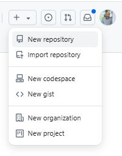

Then fill in the details

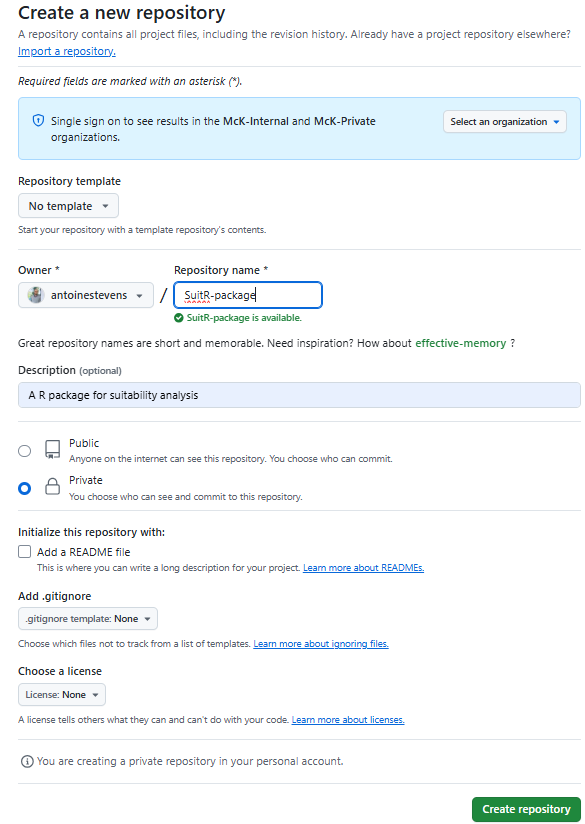

When interacting with a remote Git server, such as GitHub, you must provide credentials as part of the request. This authentication confirms your identity as a specific GitHub user and verifies that you have the necessary permissions to perform the requested action.

See [here](https://happygitwithr.com/https-pat) (https, easier) and [here](https://happygitwithr.com/ssh-keys) (ssh) for detailed instructions

## 2.3 IDE integration

Fortunately, you don’t have to memorize every Git command to be productive: **RStudio (and other IDEs) can handle the most common Git actions** (clone, stage, commit, pull, push) via the Git pane. You will still benefit from knowing what’s happening under the hood, but the IDE helps you avoid mistakes.

For IDE-specific walkthroughs, see:

\- [Happy Git: using Git in RStudio](https://happygitwithr.com/usage-intro)

\- [Positron Git guide](https://positron.posit.co/git.html)

\- [Source Control in VS Code](https://code.visualstudio.com/docs/sourcecontrol/overview)

Assuming you are using Rstudio, Git integrates well and will provide a nice GUI to move files to staging area, do commits, etc. To enable Git integration in RStudio, you need to ensure that RStudio can locate the Git executable installed on your system. Follow these steps:

1.  In RStudio, go to **Tools \> Global Options \> Git/SVN**.

2.  Confirm that the option **“Enable version control interface for RStudio projects”** is checked.

3.  Verify that the **“Git executable:”** path points to the correct location of the Git installation on your computer.

4.  If the path is missing or incorrect, click **“Browse...”**, navigate to the folder where Git is installed, and select the Git executable file (typically named `git.exe` on Windows).

5.  After making these changes, **restart RStudio** to ensure the settings take effect.

Once correctly configured, RStudio will display a **Git** tab in your project pane whenever you open a project that is under version control, making it easy to manage commits, view file changes, and synchronize with a remote repository.

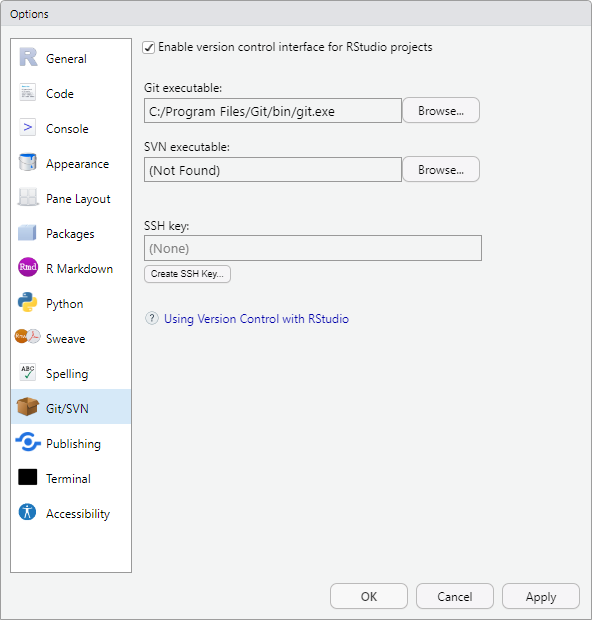

Some tips for common problems can be found [here](https://happygitwithr.com/rstudio-see-git#rstudio-see-git)

## **2.4 Creating a Rstudio project with git and Github**

Now that we have git and Github ready, let’s see how to start a Rstudio project. As suggested [here](https://intro2r.com/setting-up-a-project-in-rstudio.html), there are really two ways to get this done.

-   **Option 1**: Create a GitHub repository first, then use RStudio to clone it to your local computer and begin working.

-   **Option 2**: Create a local Git repository within RStudio first, then connect it to a new repository on GitHub.

Both methods are valid and widely used. But if you're completely new to Git and GitHub, it is recommend starting with **Option 1**. It's more straightforward, as RStudio takes care of much of the setup for you. You'll have a fully functional Git repository linked to GitHub right away, allowing you to push and pull with minimal configuration. **Option 2** involves setting up Git locally first and configuring the GitHub connection afterward. While it offers more flexibility, it also requires more manual steps and is more prone to setup errors.

Let’s follow **Option 1**, and proceed with the following steps:

1.  In RStudio click on the `File` -\> `New Project` menu. In the pop up window select `Version Control`.

    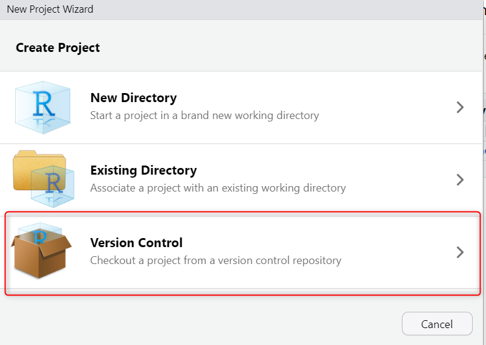

<!-- -->

2.  Paste the the URL (e.g., `https://github.com/UCLouvain-GEOG/LGEO2185.git` , it could be an empty repo that you created following section 2.2) from GitHub, fill in the directory name and subdirectory and create the Project 

    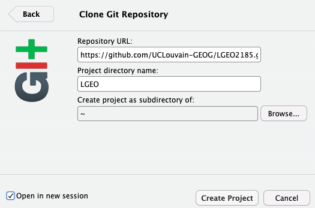

3.  This will basically clone the repo to your local machine and start a new Project.

With that, **Option 1 is complete**: you now have a GitHub repository set up and linked to a local Git repository managed through RStudio. From this point on, any changes you make to files within this project directory will be tracked by Git, enabling full version control of your work.

4\. RStudio opens the new `.Rproj` automatically. Notice the **Git pane** lets you:

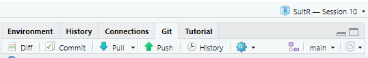

\- see file status (modified / untracked)

\- view diffs

\- stage files

\- write commit messages and commit

\- push/pull with buttons

# 3. A simple version control workflow

We are now ready to start developing our scripts and tracking changes using git and Github.

## **3.1 Staging files**

After creating new scripts, you will notice under the Git pane that we have now files in the staging area (below an example after copy-pasting the SuitR package folder developed in a previous session):

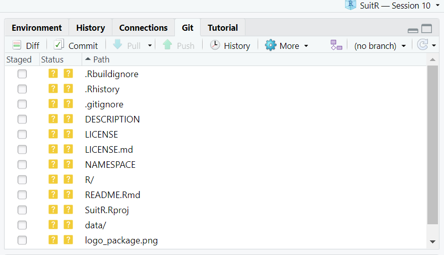

This is not necessarily all your files, but only those that have changed since the last commit (since we didn’t commit anything yet, we can see all the files). This is what the staging area is for!

In RStudio, the coloured squares show the *status* of each file, according to the following convention:

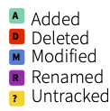 

-   **Staged File (checkmark):** The file has been **staged** and is ready to be committed. This means you've checked the box next to the file in the Git pane.

-   **Modified File (blue “M”):** the file has been **modified** since the last commit but is **not yet staged**. You need to check the box next to the file to stage it before committing.

-   **Untracked File (yellow question mark “?”):** Git sees this file for the first time — it's **not being tracked yet**. You'll need to stage it to start tracking it (by checking the box in the Git pane). If the file should never be tracked (e.g., a temporary file), consider adding it to `.gitignore`.

-   **Deleted File (red “D”):** The file has been **deleted** from your working directory, but Git still tracks it. If this is intentional, stage the deletion to reflect the change in the next commit. If it was deleted accidentally, you can recover it before committing.

-   **New File (green “A”):** This file has been **added and staged** — ready to be committed. It was previously untracked and has now been marked to be included in the version history.

The files we have now are “untracked” and we can *stage* the files we want to commit by clicking the appropriate tick box.

## **3.2 Committing**

Once you've staged the files you want to include, click the **Commit** button to open the commit interface. This will bring up a new window with three panes:

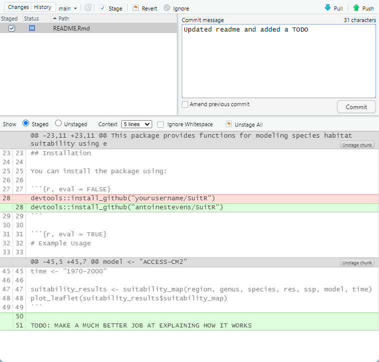

1.  **Staging Area (Top Left Pane):** This pane shows the list of files you've staged, identical to what you see in the main Git tab. You can still stage or unstage files here by checking or unchecking them. Only the staged files will be included in the commit.

2.  **2. Commit Message (Top Right Pane):** Here, you enter a short message describing the changes you're about to commit. While Git doesn't enforce specific formatting, it's a good habit to write clear, meaningful messages that explain *what* you changed and *why*. This makes it much easier to review your project's history later.

    **Examples of good commit messages:** `"Add initial data cleaning script"` , `"Fix typo in model fitting function"` , `"Update README with usage instructions"` .

    **Avoid vague messages** like "stuff" or "final version" — they offer no useful context when you’re trying to troubleshoot or revisit past work.

3.  **Differences (Bottom Pane):** This pane shows the **diff** for the selected file — that is, the line-by-line differences between the current version and the last committed version. **Green lines** indicate new code or text that has been added. **Red lines** show what has been removed. If a line was modified, you'll see both a red (removed) and a green (added) version. This view allows you to **review your changes before committing**, which is a great way to catch mistakes or double-check that you’re committing only what you intended.

After reviewing your changes and writing a commit message, click the **Commit** button at the bottom right of the window. The selected changes are now saved to your local Git history. A pop up will appear with the outcome of your commit. We changed here 1 file, made 3 insertions and 1 deletion…

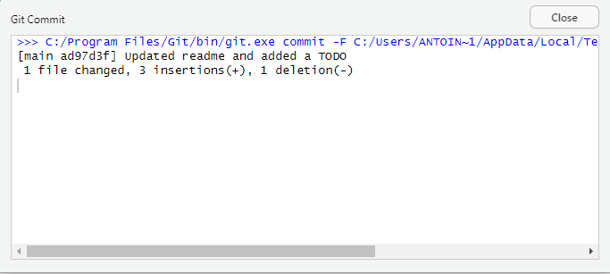

If you are running with a local and online version of the repository then your Git pane will now show a message detailing how out of sync they are.

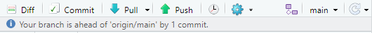

## **3.3 Going back to previous versions**

One of the most powerful features of Git is the ability to roll back changes and restore previous versions of your files. This is especially useful when you've made a mistake, introduced a bug, or simply want to undo recent edits.

### **Reverting to the last commit**

If you've made changes to a file and want to discard them — returning the file to its most recently committed state, you shoud:

-   Open the **Git** tab in RStudio

-   Find the file you want to revert

-   Click the file to view the **diff** (i.e., what has changed)

-   At the top of the diff viewer, click the **“Revert”** button.

Be careful, you will definitely loose any edits by reverting to the last commit!

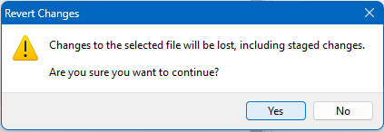

### **Reverting to an older version of a file from any previous commit**

If you want to restore a file to how it looked at an earlier point in time, you will need to find the hash of that commit and use the `git checkout` command:

-   In the **Commit** view, click the **History** button to open the commit history of the project.

-   Select the commit where the file was in the state you want to recover.

-   When you click on a commit, RStudio will show the list of files that were changed in that commit.

-   In the diff view, you'll see the **commit hash** (a alphanumeric string, e.g., `a1b2c3d`).

-   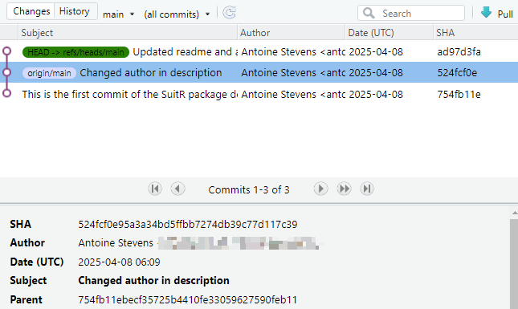

<!-- -->

-   Copy that hash — you'll use it to check out the file from that exact commit.

-   Click the **Terminal** tab (next to the Console) in Rstudio

-   Use the following Git command to restore the file: `git checkout <commit-hash> path/to/your/file.R`

    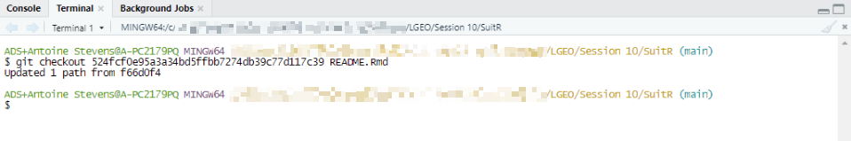

The file will now appear in the **Git** tab as modified. Review it if needed, then stage and commit the change to make the restored version part of your current project history.

## **3.4 Push/pull**

Once you’re satisfied with your commit(s), you can send them to GitHub by clicking the green **Push**arrow in the Git tab. Before doing that, it’s a good idea to check whether your local repository is up to date with the remote version (typically the `main` branch on GitHub). To do this, use the **Pull**button (the blue downward-facing arrow) to fetch and apply any changes from the remote repository. This helps prevent potential conflicts and ensures you’re working with the latest version of the project.

If you visit your repository on GitHub, you’ll see that your changes have been successfully reflected online. This confirms that your local commits have been pushed and are now part of the remote project history.

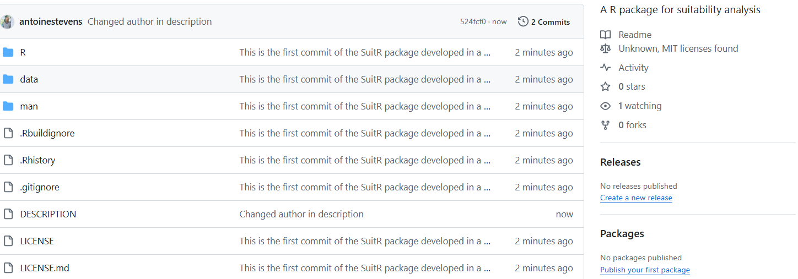

# 4. Practical applications

:::: assignment
## Assignment: contribute to LGEO2185

Put the workflow into practice by proposing a change to the course repository. **Goal:** create a branch, make a small edit, push, and open a Pull Request (PR) ready to be merged to `main`.

::: callout-note
In this assignment we use **RStudio’s Git pane** (no command line needed).
:::

### 1) Clone (create an RStudio project from Git)

1.  In RStudio: **File ▸ New Project… ▸ Version Control ▸ Git**

2.  Repository URL: `https://github.com/UCLouvain-GEOG/LGEO2185.git` (or SSH if configured)

3.  Choose a local folder and click **Create Project**

RStudio clones the repo and opens the `.Rproj`. You should now see the **Git** tab/pane.

### 2) Create a branch (work safely)

We never work directly on `main` for contributions.

1.  In the **Git** pane, find the **branch logo** (usually `main` is next to is) and choose:
    -   **New Branch…**
2.  Name your branch: `assignment/<your-id>`

Use a short identifier that uniquely identifies you, for example:

\- your GitHub username

\- your initials + a number (if needed)

### 3) Apply a small change

Edit **one** Quarto file in the repository (e.g., clarify text, add a reference, fix a typo).

Guidelines: - keep scope small (one file / one idea) - save the file

### 4) Commit (snapshot your work)

1.  Open the **Git** pane. You should see your edited file listed as *modified*.
2.  Check the box next to **only the relevant file(s)** to stage them.
3.  Click **Commit**.
4.  Write an informative message, e.g.
    -   “Fix typo in Collaboration section”
    -   “Clarify explanation of pull requests”
5.  Click **Commit**.

### 5) Push (send your branch to GitHub)

1.  In the Git pane, click **Push**.
2.  If RStudio asks to set an upstream/tracking branch, accept the default.

> If push fails because you don’t have permission to the main repo, ask the repo owner (instructor) to get rights.

### 6) Open a Pull Request (PR) on GitHub

1.  Go to the repository on GitHub.
2.  You should see a banner suggesting to open a PR from your recently pushed branch — click **Compare & pull request**.
3.  Make sure the PR targets:
    -   **base repo:** `UCLouvain-GEOG/LGEO2185`
    -   **base branch:** `main`
4.  In the description:
    -   mention the file/section edited
    -   summarize the change in 1–2 sentences

### 7) Review & merge (GitHub UI)

-   The instructor will review your PR.
-   If changes are requested, update your work locally in RStudio, then **commit again** and **push again** (the PR updates automatically).
-   The instructor will merge (or close) the PR via the GitHub UI.

### 8) Clean up (optional but good practice)

After the PR is merged (or closed), delete your branch:

\- On GitHub: click **Delete branch** (often shown after merge)

\- In RStudio: switch back to `main`, then delete `assignment/<your-id>` locally if the branch menu offers it

### Submit

Submit the **PR URL**.
::::
