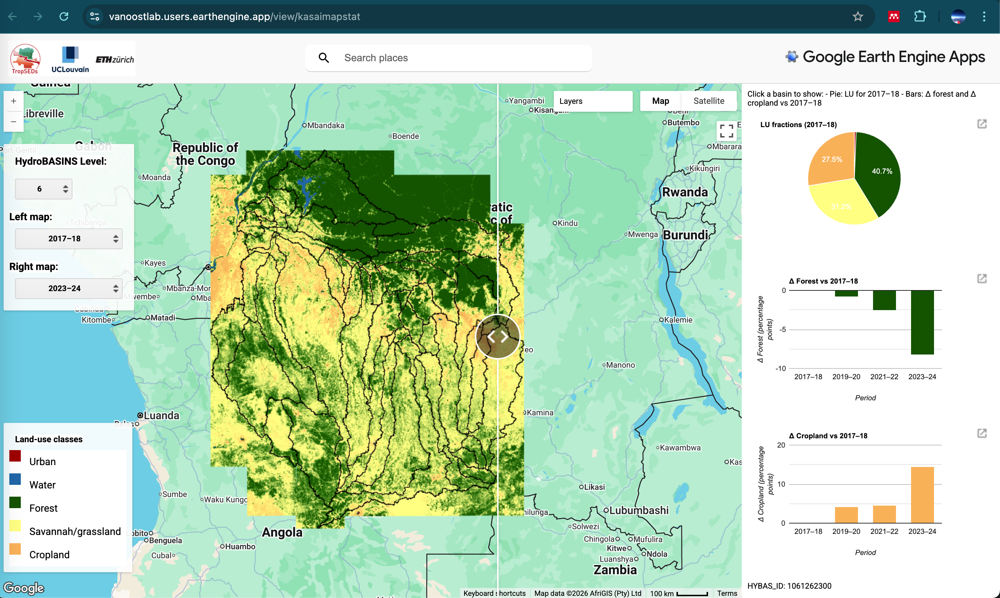
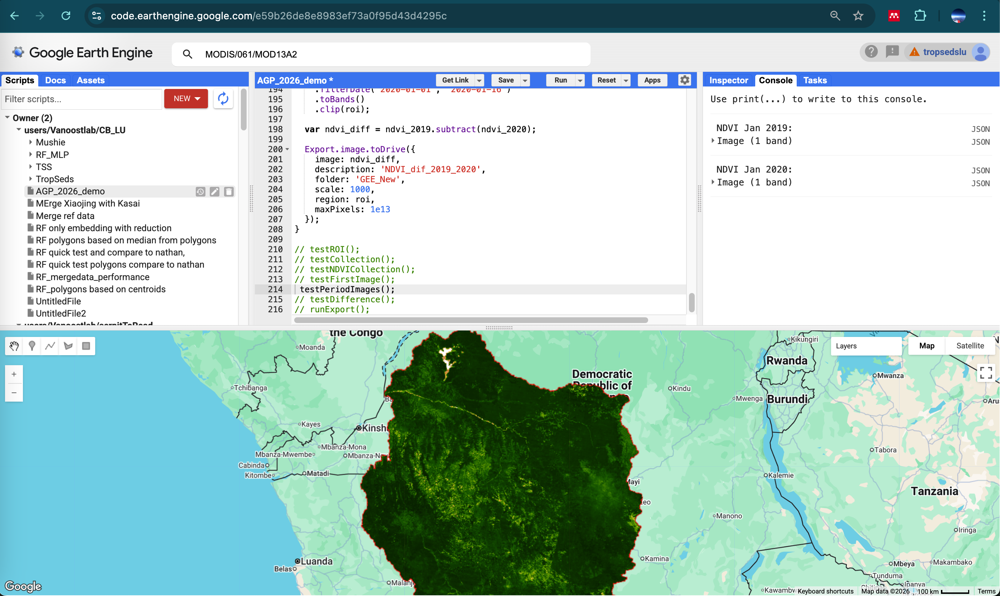

In this session, we explore how Google Earth Engine can be used to prepare predictor variables for land-cover classification. We begin with a short demo in the GEE Code Editor to become familiar with the platform, its logic, and its main geospatial data structures. We then move to a case study in Ilebo (DR Congo), where we use reference land-use polygons and Sentinel-2 imagery. Using the GEE Python API, we extract spectral information for these polygons in order to build a predictor dataset. This dataset will serve as the input for a Random Forest land-cover classification model in the next session.

# 0. GEE Code Editor demo

In this demo, we explore the **Google Earth Engine (GEE) Code Editor**, the main online environment for working with Earth observation data in Google Earth Engine.

The GEE Code Editor is a browser-based platform that allows users to access, process, visualize, and export very large geospatial datasets without downloading them locally first. Instead of working with files stored on your own computer, you work directly with data hosted in the cloud. This is one of the main differences compared with more traditional GIS workflows. Here is an example of a GEE application (*Zhao & Carlier et al., in review*):

{fig-align="center" width="500"}

### General approach of Google Earth Engine

The philosophy of GEE is to bring the **computation to the data**, rather than bringing the data to your computer. Large satellite archives such as Landsat, Sentinel, MODIS, climate products, land-cover datasets, and many others are already available on Google’s servers. Users write relatively compact scripts to filter, combine, analyse, create new and visualize these datasets.

This makes GEE especially powerful for:

-   large regions
-   long time series
-   repetitive workflows
-   remote sensing analyses requiring many images

In practice you query image collections, apply filters in space and time, calculate indices or statistics, and visualize or export the result.

### Main concepts

A few key concepts are central in Earth Engine.

**Geometry / region of interest (ROI)**\
Most analyses begin by defining a study area, for example a point, polygon, watershed, or administrative boundary.

**Image**\
An `image` is a raster dataset for one date or one layer, for example a Sentinel-2 scene or a DEM.

**ImageCollection**\
An `ImageCollection` is a set of images, often through time, such as all MODIS NDVI images between 2019 and 2020.

**Feature and FeatureCollection**\
These are vector objects, such as points, polygons, shapefiles, or training data.

**Filtering and mapping**\
You often filter a collection by date, location, or metadata, and then apply a function to each image in the collection.

**Visualization versus computation**\
Displaying a layer on the map is not the same as exporting or analysing it. Visualization is mainly for inspection; computation produces the actual outputs.

### Structure of the GEE Code Editor

The Code Editor is organized around a few key panels:

-   the **script panel**, where you write JavaScript code
-   the **map window**, where you display layers
-   the **Inspector**, to click and explore values
-   the **Console**, where you print objects and messages
-   the **Tasks** tab, where exports are launched

{fig-align="center"}

This makes the environment very suitable for interactive experimentation: you can write a few lines of code, run them, inspect the result, and progressively build a workflow.

### Advantages of the GEE Code Editor

The main advantages of Earth Engine are:

-   free access for non-commerical (eg academic) use
-   direct access to a very large catalog of remote sensing and environmental datasets
-   cloud computing, so there is no need to store or process everything locally
-   fast prototyping of workflows
-   easy repetition of the same analysis over large areas or long periods
-   strong support for time series analysis and large-scale remote sensing
-   easy sharing of scripts with collaborators or students

For teaching, GEE is especially useful because students can quickly move from theory to practice without complex software installation or data management.

### Typical use cases

Typical applications of GEE include:

-   calculating vegetation indices such as NDVI
-   mapping land cover and land-use change
-   analysing drought, floods, fire, or deforestation
-   extracting time series for a study area
-   comparing satellite images between dates
-   building training datasets for classification
-   exporting maps or derived products for further analysis in a geoprocessing-workflow

::: callout-note
## Further resources

If you would like to continue exploring Google Earth Engine beyond this demo, the following resources are highly recommended:

-   [Spatial Thoughts – Google Earth Engine course](https://spatialthoughts.com/courses/google-earth-engine/)
-   [Google Earth Engine main website](https://earthengine.google.com/)
-   [Google Earth Engine developer documentation](https://developers.google.com/earth-engine/)
-   [Google Earth Engine case studies](https://earthengine.google.com/case_studies/)

Together, these resources offer tutorials, documentation, practical examples, and inspiring real-world applications of GEE in environmental and geospatial research.
:::

# 1. Demo basic GEE

In this demo, we will use the following script (in-class activity):

<https://code.earthengine.google.com/e59b26de8e8983ef73a0f95d43d4295c>

The goal is to become familiar with:

-   the layout of the Code Editor
-   the logic of a simple Earth Engine script
-   how to display data on the map
-   how to inspect intermediate outputs
-   how to structure a basic remote sensing workflow

# 2. Case Study Land cover classification based on Sentinel-2

In this case study, we use an existing reference land-use database that was created from ultra-high-resolution imagery for the city of Ilebo (DR Congo). In the section below, we use the GEE Python API to extract Sentinel-2 spectral bands for these reference polygons. The objective is to prepare the predictor data needed to build a Random Forest model, which we will develop in the next session. In other words, this section focuses on preparing the data required for Random Forest classification using the GEE Python API.

::: callout-note
You can run the code below in your preferred Python environment, or alternatively use the link to this Colab script.

<https://colab.research.google.com/drive/10bXTdSLQ9sCo-ZtCs0cUWJhyadHknoHM?usp=sharing>

To do so, you will need to be logged into your browser with your Google account and have an active Google Cloud project with Earth Engine enabled, as explained in last week’s assignment.
:::

::: callout-note
**Caution: the code below is Python code that will not run in RStudio!**
:::

```{r}
#| warning: false
library(reticulate)
use_python("~/quarto-gee312/.venv/bin/python", required = TRUE)
py_config()
py_module_available("ee")
```

## 2.1 Authenicate your initialize GEE

```{python}
import ee

PROJECT = "tropsedslu"

try:
    ee.Initialize(project=PROJECT)
    print("Earth Engine initialized from saved credentials")
except Exception:
    ee.Authenticate()
    ee.Initialize(project=PROJECT)
    print("Earth Engine authenticated and initialized")
```

## 2.2 Load the training polygons

The training polygons are already stored as an Earth Engine asset. These polygons are the areas for which we want to extract Sentinel-2 information.

```{python}
asset_path = "projects/tropsedslu/assets/CB/Basins/Kasai_training_Ilebo"
feature_collection = ee.FeatureCollection(asset_path)

print("Number of polygons:", feature_collection.size().getInfo())
print("Available properties in first feature:")
print(feature_collection.first().propertyNames().getInfo())
```

Quickly explore the `class` properties

```{python}
# Calculate the histogram of the 'class' property to get counts for each unique class
class_counts_ee = feature_collection.aggregate_histogram('class')

# Get the results from Earth Engine
class_counts_dict = class_counts_ee.getInfo()

# Convert the dictionary to a pandas DataFrame for a tabular display
import pandas as pd
class_counts_df = pd.DataFrame(list(class_counts_dict.items()), columns=['Class', 'Number of Polygons'])

print("Summary of unique polygons per class:")
print(class_counts_df.to_string(index=False))

```

Visualize the feature_collection so we know what we are working with

```{python}
import folium
import ee

# Define the color scheme for the 'class' property
classColors = ee.Dictionary({
    'water':    '#1f78b4',
    'built_up': '#e31a1c',
    'cropland': '#e6ab02',
    'forest':   '#1b9e77',
    'savannah': '#66a61e'
})

# Function to style features based on their 'class' property
def style_by_class(feature):
    color = classColors.get(feature.get('class'))
    return feature.set({'style': {'color': color, 'width': 2}})

# Apply styling
styled_feature_collection = feature_collection.map(style_by_class)

# Get centroid for centering the map
center_point = feature_collection.geometry().centroid().coordinates().getInfo()

# Create map without default tiles
m = folium.Map(location=[center_point[1], center_point[0]], zoom_start=11, tiles=None)

# Add satellite basemap
folium.TileLayer(
    tiles='https://mt1.google.com/vt/lyrs=s&x={x}&y={y}&z={z}',
    attr='Google Satellite',
    name='Satellite',
    overlay=False,
    control=True
).add_to(m)

# Optional: add a normal map too
folium.TileLayer(
    tiles='OpenStreetMap',
    name='OpenStreetMap',
    overlay=False,
    control=True
).add_to(m)

# Get Earth Engine map tiles
map_id_dict = ee.data.getMapId({
    'image': styled_feature_collection.style(styleProperty='style')
})

# Add Earth Engine layer
folium.TileLayer(
    tiles=map_id_dict['tile_fetcher'].url_format,
    attr='Google Earth Engine',
    overlay=True,
    name='Training polygons'
).add_to(m)

# Add layer control
folium.LayerControl().add_to(m)

# Add legend
legend_html = """
<div style="
    position: fixed; 
    bottom: 40px; left: 40px; width: 180px;
    background-color: white; 
    border: 2px solid grey; 
    z-index:9999; 
    font-size:14px;
    padding: 10px;
    border-radius: 6px;
    box-shadow: 2px 2px 6px rgba(0,0,0,0.2);
">
    <b>Legend</b><br><br>
    <div><span style="display:inline-block;width:14px;height:14px;background:#1f78b4;margin-right:8px;border-radius:2px;"></span>Water</div>
    <div><span style="display:inline-block;width:14px;height:14px;background:#e31a1c;margin-right:8px;border-radius:2px;"></span>Built-up</div>
    <div><span style="display:inline-block;width:14px;height:14px;background:#e6ab02;margin-right:8px;border-radius:2px;"></span>Cropland</div>
    <div><span style="display:inline-block;width:14px;height:14px;background:#1b9e77;margin-right:8px;border-radius:2px;"></span>Forest</div>
    <div><span style="display:inline-block;width:14px;height:14px;background:#66a61e;margin-right:8px;border-radius:2px;"></span>Savannah</div>
</div>
"""
m.get_root().html.add_child(folium.Element(legend_html))

# Display map
m
```

## 2.3 Define the region of interest and years

To keep exports small, we only export the area around the polygons. We use the bounding box of the polygon collection as the export region.

```{python}
roi = feature_collection.geometry().bounds()

start_year = 2020
end_year = 2025
export_scale = 10

print("Start year:", start_year)
print("End year:", end_year)
print("Export scale (m):", export_scale)
```

## 2.4. Select Sentinel-2 bands

We keep a limited set of useful bands instead of exporting everything. This makes the rasters much smaller than exporting the full Sentinel-2 stack.

```{python}
spectral_bands = ["B1", "B2", "B3", "B4", "B5", "B6", "B7", "B8", "B8A", "B9", "B11", "B12"]
index_bands = ["NDVI", "EVI", "BSI"]
all_export_bands = spectral_bands + index_bands

print(all_export_bands)
```

## 2.5. Define functions

Why this step? Sentinel-2 contains cloudy pixels. We mask clouds and cloud shadows using the SCL band from the Level-2A surface reflectance product. We use COPERNICUS/S2_SR_HARMONIZED, which is the recommended Earth Engine Sentinel-2 SR collection for a consistent time series.

```{python}
def mask_s2_sr(image):
    """Mask clouds and cloud shadows using the SCL band."""
    scl = image.select("SCL")

    mask = (
        scl.neq(3)    # cloud shadow
        .And(scl.neq(8))   # medium probability cloud
        .And(scl.neq(9))   # high probability cloud
        .And(scl.neq(10))  # cirrus
    )

    return image.updateMask(mask).select(spectral_bands)


def add_indices(image):
    """Add NDVI, EVI and BSI."""
    ndvi = image.normalizedDifference(["B8", "B4"]).rename("NDVI")

    evi = image.expression(
        "2.5 * ((nir - red) / (nir + 6 * red - 7.5 * blue + 1))",
        {
            "nir": image.select("B8"),
            "red": image.select("B4"),
            "blue": image.select("B2"),
        },
    ).rename("EVI")

    bsi = image.expression(
        "((swir1 + red) - (nir + blue)) / ((swir1 + red) + (nir + blue))",
        {
            "swir1": image.select("B11"),
            "red": image.select("B4"),
            "nir": image.select("B8"),
            "blue": image.select("B2"),
        },
    ).rename("BSI")

    return image.addBands([ndvi, evi, bsi])
```

## 2.6 Create annual composites

For each year:

-   filter Sentinel-2 images to that year and ROI
-   mask clouds
-   calculate the median composite
-   add vegetation/soil indices
-   keep only the bands we want to export

```{python}
def make_annual_composite(year):
    start_date = ee.Date.fromYMD(year, 1, 1)
    end_date = ee.Date.fromYMD(year, 12, 31)

    s2 = (
        ee.ImageCollection("COPERNICUS/S2_SR_HARMONIZED")
        .filterDate(start_date, end_date)
        .filterBounds(roi)
        .map(mask_s2_sr)
    )

    composite = s2.median().clip(roi)
    composite = add_indices(composite).select(all_export_bands)

    return composite.set("year", year)


annual_composites = ee.ImageCollection.fromImages([
    make_annual_composite(year) for year in range(start_year, end_year + 1)
])

print("Number of annual composites:", annual_composites.size().getInfo())
```

## 2.7 Convert to compact integers

This step just reduces the file size by converting to integers.

```{python}
def to_compact_int(image):
    refl = image.select(spectral_bands).round().toInt16()
    idx = image.select(index_bands).multiply(10000).round().toInt16()
    return refl.addBands(idx).copyProperties(image, ["year"])


annual_composites_int = annual_composites.map(to_compact_int)
first_image = ee.Image(annual_composites_int.first())
print(first_image.bandNames().getInfo())
```

## 2.8 Export the 2025 composite to Google Drive

```{python}
#| eval: false
final_year_image = annual_composites_int.filter(ee.Filter.eq("year", end_year)).first()
image_export_scale = 30

task = ee.batch.Export.image.toDrive(
    image=final_year_image,
    description=f"Ilebo_S2_{end_year}_int_30m",
    folder="GEE_Exports_S2_Ilebo",
    fileNamePrefix=f"ilebo_s2_{end_year}_int_30m",
    region=roi,
    scale=image_export_scale,
    maxPixels=1e10,
    fileFormat="GeoTIFF",
    formatOptions={"cloudOptimized": True},
    skipEmptyTiles=True
)
task.start()

print(f"Export started for final year composite ({end_year}) at {image_export_scale} m.")
```

## 2.9 Export Polygon Band Values to Drive (Shapefile)

```{python}
#| eval: false
# Define the reducer to calculate the mean value within each polygon.
reducer = ee.Reducer.mean()

# Initialize an empty FeatureCollection to store all extracted polygon data.
all_extracted_features = ee.FeatureCollection([])

# Get the list of images from the annual composites.
# We will iterate through these images client-side.
images_list = annual_composites_int.toList(annual_composites_int.size())

# Loop through each annual composite image.
for i in range(annual_composites_int.size().getInfo()):
    composite_image = ee.Image(images_list.get(i))
    composite_year = composite_image.get('year').getInfo()

    # Filter the original feature_collection to get polygons that match the current composite's year.
    polygons_for_this_year = feature_collection.filter(ee.Filter.eq('year', composite_year))

    # Only proceed if there are polygons for the current year.
    if polygons_for_this_year.size().getInfo() > 0:
        # Extract mean band values for the filtered polygons from the current annual composite.
        # reduceRegions adds properties for each band (e.g., 'B1_mean', 'NDVI_mean').
        # Original feature properties (like 'class', 'site') are preserved.
        extracted_values_for_year = composite_image.reduceRegions(
            collection=polygons_for_this_year,
            reducer=reducer,
            scale=export_scale
        )

        # Merge the results for this year into the overall collection.
        all_extracted_features = all_extracted_features.merge(extracted_values_for_year)
        print(f'Extracted values for {composite_year}: {extracted_values_for_year.size().getInfo()} features.')
    else:
        print(f'No polygons found with year property matching {composite_year}.')

print(f'Total features with extracted values: {all_extracted_features.size().getInfo()}')

# Export the final FeatureCollection as a Shapefile to Google Drive.
export_task = ee.batch.Export.table.toDrive(
    collection=all_extracted_features,
    description='Ilebo_Polygon_Band_Values_SHP',
    folder='GEE_Exports_S2_Ilebo', # Use the same folder as the image exports
    fileNamePrefix='ilebo_polygon_band_values',
    fileFormat='SHP' # Export as a Shapefile
)
export_task.start()
print('Export task started for polygon band values to Google Drive (Shapefile).')

```
