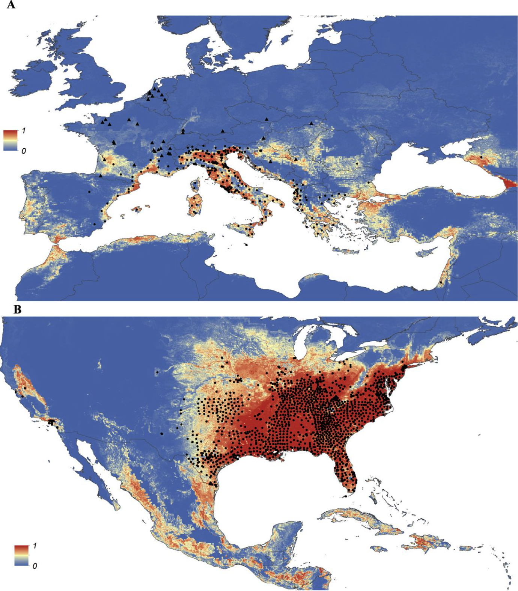
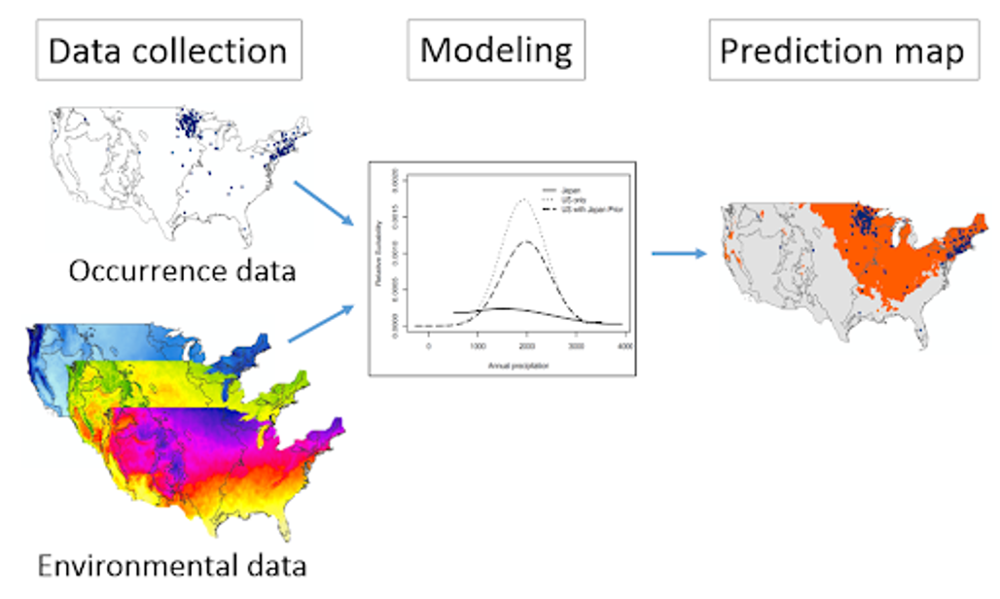

```{r setup, include=FALSE, warning=FALSE}
knitr::opts_chunk$set(
    echo = TRUE,
    message = FALSE,
    warning = FALSE
)

pacman::p_load(geodata, terra, leaflet, mapview, leafsync, here, MASS, caret)
```

# Today’s program

-   Basic Project Assignment: discussion
-   Advanced geoprocessing: Geoprojects, structure, implementation
-   Open Science

# Today’s Learning Objectives

-   Developing a geo-spatial model

# Additional resources

-   [Axolotl](https://en.wikipedia.org/wiki/Axolotl)
-   [Biodiversity data](https://www.gbif.org/)
-   Daniele's [GitLab repo](https://gitlab.com/danidr/geoprocessing)
-   https://geco-bern.github.io/agds/introduction.html#what-is-applied-geodata-science

# 1. Introduction

Today, we are interested in the factors that control the spatial distribution of a given species (habitat and suitability maps a.k.a. species distribution models), and predict how these will evolve under predicted climate change. Look at the example below from @kraemer2015. Dots represent the observed occurrence of mosquito's in Europe and the color scale represents the suitability (ranging from 1 highly suited to 0 not suitable) of the climatic conditions for the given species:

\#{width="50%"}

```{r echo = FALSE, results = 'asis'}
image <- "https://iiif.elifesciences.org/lax/08347%2Felife-08347-fig3-v3.tif/full/,1500/0/default.jpg"
#cat(paste0('<center></center>'))
htmltools::HTML(
  sprintf('<div style="text-align:center;"></div>', image)
)
```

The above maps are the result of a statistical model where the species presence/absence is modelled as:

$$
\text{Species Presence/Absence} \sim \text{Pred}_1 + \text{Pred}_2 + \dots + \text{Pred}_n
$$

Such model can be easily constructed based a database with observations and predictor variables. Let's see how we could do this by exploring the following `data.frame` You can download the data manually from here [Download the dataset (RDS)](https://uclouvain-geog.github.io/LGEO2185/Data/occurrence_data.Rds) and copy it into your `data/raw` folder (or load it directly from R as done here):

```{r}
pacman::p_load(tidyverse, here, corrplot, modEvA)
occurrence_df <- readRDS(url("https://uclouvain-geog.github.io/LGEO2185/Data/occurrence_data.Rds","rb"))
#glimpse(occurrence_df)
```

Now explore `occurence_df` in the explorer. The variables `wc2.1_10m_bio_?`\` are derived from the worldclim Bioclimatic variables, more info [here](https://www.worldclim.org/data/bioclim.html). You could further explore this dataset as follows:

```{r 1}
# Exploratory analysis
summary(occurrence_df)
correlation <- cor((occurrence_df), use = "complete.obs") # there are some NA
corrplot::corrplot(correlation)

# Model
myMod <- glm(pres ~ ., data = occurrence_df, family = "binomial")
summary(myMod)
modEvA::Dsquared(myMod, adjust = TRUE) # proportion of deviance explained by a GLM
```

```{r}
# #check the imporance of the variables: dropterm function removes one-by-one one of the variable and test its importance in the model selection procedure.
 library(MASS)
# dropterm(myMod, test = "Chisq")
 #now modify your model, or remove highly correlated predictors and then a stepwise AIC-based selection
library(caret)
# remove highly correlated numeric predictors (cutoff = 0.8)
num <- sapply(occurrence_df, is.numeric)
num["pres"] <- FALSE
drop <- findCorrelation(cor(occurrence_df[, num], use = "pairwise.complete.obs"),
                        cutoff = 0.8, names = TRUE)

df_red <- occurrence_df[, !(names(occurrence_df) %in% drop)]
# GLM + AIC stepwise
myMod_selection <- step(
  glm(pres ~ ., data = df_red, family = binomial()),
  direction = "both",
  trace = 0
)

summary(myMod_selection)
modEvA::Dsquared(myMod_selection, adjust = TRUE) # proportion of deviance explained by a GLM
```

If you have spatial data describing the predictors, you could apply the model and create spatial maps. That is what we will do below!

# 2. Objective

The objective of our project is to map the Habitat distribution of a given species, in a given area, at a given time: current and future climatic conditions. The output should be a change analysis current -\> to future (2050 -\> 2070 etc)... Something like this:

```{r 2, echo=FALSE, eval=TRUE, cache = FALSE}
pacman::p_load(geodata, raster, terra, leaflet, leafsync, mapview)
source(file.path("R", "suitability_fn.R"))
options(geodata_default_path = "data/raw")
region <- gadm(country = "MEX", level = 0, path = "data/raw")
output <- suitability_map(region = region, genus = "ambystoma", species = "mexicanum", res = 10, model = "ACCESS-CM2", ssp = "126")
r <- output$suitability_map
plot_leaflet(r)
```

Cool! Now let's break this down and work step by step

# 3. Setting up a workflow

## 3.1 Summary

A geoproject's workflow can be summarized as follows:

-   Identify a clear goal

-   Decompose the framework into small steps:

    -   the conceptual aspect
    -   the practical aspect : the data I need and the methodology
    -   the coding aspect.

As always, consider reproducibility and clear coding ;-) We can conceptualize the project as follows: {width="50%"}

## 3.2 Define data needs

So what kind of data do we need?

```         
+   Species occurrences (GBIF)
+   Species absences: randomly generated
+   Climatic variables (Worldclim) + Vegetation
+   A given species
+   An Area of Interest
```

Before jumping into the workflow, take your time to understand your data, here we will work with Worldclim (see session 1 to 3) and GBIF. Note that we can extract occurrences (sightings) of tspecies using the `sp_occurrence` function of the `geodata` package. This links to the Global Biodiversity data [see here](https://www.gbif.org/) for more info. Make sure you understand the different options of the `sp_occurrence` function. Create a model which is able to produce as output a species suitability map (in-class, this will be developed here below). Modify your code in order to get predictions for multiple species and/or future scenarios (assignment).

## 3.3 Visualize the workflow

```{mermaid}
%%| echo: false

flowchart TD
  A[["<b>INPUT</b>
    1. Set ROI (SpatVector)
    2. Set Species: name, genus (string)
    "]]
    
  B[["<b>MAIN STEPS</b>
    1. Get predictors (SpatRaster)
    2. Get occurrences data (Data.Frame)
    3. Extract predictor values at occurrence and absence locations (Data.Frame)
    4. Fit a model (glm object)
    5. Spatial predictions using fitted model (SpatRaster)
    "]]

  B1[["<b>Get Predictors</b><br>1. Download worldclim & cmip6 (SpatRaster) <br>2. Stack <br>3. Crop & mask <br>"]]
  B2[["<b>Get occurrence</b><br>1. Download GBIF (Data.Frame) <br>2. Add random absences <br>3. Create a dependent variable (0/1) <br>"]]

  C[["<b>OUTPUT</b>
        1. Suitability maps
        2. Plots"]]

  A --> PROCESSING
  PROCESSING --> C
  subgraph PROCESSING
   B --> |STEP 1 Details| B1 
   B --> |STEP 2 Details| B2 
    end
 
  style A text-align:left
  style B text-align:left
  style C text-align:left  
  style B1 text-align:left
  style B2 text-align:left
```

::: callout-note
In species distribution modeling (SDM), we typically need both presence and absence data to train a predictive model. However, for many species, true absence data is not available (since most datasets only record where a species has been found, not where it does not occur). This is where pseudo-absence selection comes in: we generate artificial "absence" points in places where the species might not exist.
:::

# 4. Coding first steps

At first, let's try to create a code for a specific example, i.e. without any loops and/or function calls. We try to model for a specific species, the axolotl which can be found in Mexico.

```{r, echo = FALSE, results = 'asis'}
image <- "https://www.axolotl.org/images/animals/axolotl.jpg"
cat(paste0('<center></center>'))
```

## 4.0 Environment

```{r 40, eval = FALSE}
# Load libraries and set parameters
pacman::p_load(geodata, terra, leaflet, mapview)
setwd("path/to/my/folder")
options(geodata_default_path = file.path("data", "raw"))
```

## 4.1 Load Predictors

From the start, think about the parameters of the function (e.g., country name), this will allow to functionalize rapidly your code later... Let's start with downloading predictor variables for a given AOI Note that we define just a resolution, model and scenario for now. We download a long list of potential climatic predictors using the worldclim database, and we use the `bio` variables. See [see here for more info](https://worldclim.org/data/bioclim.html)

```{r 41}
# Create AOI
region <- "MEX"
region <- gadm(country = region, level = 0)

## STEP 1 - create RasterStack with predictors
res <- 10
model <- "ACCESS-CM2"
ssp <- "126"

predictors <- worldclim_global(var = "bio", res = res, ssp = ssp, path = "data/raw/") # https://worldclim.org/data/bioclim.html
predictors <- predictors %>%
    crop(region) %>%
    mask(region)
plot(predictors)
```

## 4.2 Load occurrences

Now, let's download occurrence for a given species

```{r 42}
## STEP 2 - Load sightings data and verification
genus <- "ambystoma"
species <- "mexicanum"
# Download observations
sightings <- sp_occurrence(genus = genus, species = species, ext = region, sp = TRUE, download = TRUE, geo = TRUE)
sightings <- vect(sightings)
crs(sightings) <- crs(region)
plot(sightings)
plot(region, add = T)
```

## 4.3 Prepare occurrences for modelling

```{r 43}
## STEP 3 - Create presence/absence database
set.seed(1975)
absence <- terra::spatSample(predictors, size = length(sightings), method = "random", na.rm = T)
absence$pres <- 0
presence <- terra::extract(predictors, sightings, df = TRUE)
presence$pres <- 1
occurrence_df <- dplyr::bind_rows(absence, presence) %>% dplyr::select(-ID)
#glimpse(occurrence_df)
```

## 4.4 Logistic Model

```{r 44}
## STEP 4 - Fit a model
myMod <- glm(pres ~ ., data = occurrence_df, family = "binomial")
summary(myMod)
```

## 4.5 Predict spatially

```{r 45}
# STEP 5 - Creating suitability layers
suitability <- predict(predictors, myMod, type = "response") ### Rastermap
```

## 4.6 Create a map

And finally, visualize the map

```{r 46}
# STEP 6 - Visualize
# you can blank the regions below a threshold
suitability <- ifel(suitability < 0.01, NA, suitability)
p <- mapview(suitability, col.regions = "red", na.color = "transparent", layer.name = "Suitability", legend = FALSE) +
    mapview(sightings, cex = 2, popup = FALSE, layer.name = "Observations")
p
```

Note that the pattern reflected by the suitability map is not matching perfectly observations. There are certainly many ways to improve this! Look e.g. [here](https://damariszurell.github.io/EEC-MGC/index.html) for a good reference on Species Distribution Modelling.

# 5. Generalizing the code

Now that it works for one example, we can now create a function which basically is a copy paste of the above, but where we add variables for the parameters. Note the use of a `list` as the output contains the output in `spatRaster` format, the model performance as well as maps. A list is very useful when combining different types of data. Note that naming the list items helps to reference the items more easily afterwards (see below).

```{r 5}
#### Wrap this in a function
my_suitability_fct <- function(region, genus, species, res) {
    ### Description: Function to model the suitability (present and future) of an area for a species.
    ### Inputs:
    ## region of interest (spatVector),
    ## genus and species of interest (see https://www.gbif.org/)
    ## res (numeric): resolution 2.5 5 or 10,
    ### Output: 1 suitability map as a map, a spatRaster suitability map, metric for model performance (Dsquared)
    require(terra)
    require(tidyverse)
    require(leaflet)
    require(geodata)
    require(modEvA)

    ## STEP 1 - create RasterStack with predictors
    predictors <- worldclim_global(
        var = "bio",
        res = res,
        path = "data/raw/"
    ) # https://worldclim.org/data/bioclim.html
    predictors <- predictors %>%
        crop(region) %>%
        mask(region)

    ## STEP 2 - Load sightings data and verification
    sightings <- sp_occurrence(
        genus = genus, species = species,
        ext = region, sp = TRUE, download = TRUE, geo = TRUE
    )
    sightings <- vect(sightings)
    crs(sightings) <- crs(region)

    ## STEP 3 - Create presence/absence database
    set.seed(1975)
    absence <- terra::spatSample(predictors,
        size = length(sightings), method = "random", na.rm = T
    )
    absence$pres <- 0
    presence <- terra::extract(predictors, sightings, df = TRUE)
    presence$pres <- 1
    occurrence_df <- dplyr::bind_rows(absence, presence) %>%
        dplyr::select(-ID)

    ## STEP 4 - Fit a model
    myMod <- glm(pres ~ ., data = occurrence_df, family = "binomial")
    # proportion of deviance explained by a GLM
    Dsq <- modEvA::Dsquared(myMod, adjust = TRUE)
    # STEP 5 - Creating suitability layers
    suitability <- predict(predictors, myMod, type = "response") ### Rastermap

    # STEP 6 - Visualize
    suitability <- ifel(suitability < 0.01, NA, suitability)

    # we use leaflet here
    pal <- colorNumeric(c("#FFFFCC", "#41B6C4", "#0C2C84"),
        domain = c(0, 1),
        na.color = "transparent"
    )
    map <- leaflet::leaflet() %>%
        leaflet::addTiles() %>%
        leaflet::addRasterImage(suitability, colors = pal, opacity = 0.8) %>%
        leaflet::addLegend(
            pal = pal, values = raster::values(suitability),
            title = paste("Suitability")
        )
    results <- (list(
        "suitability_leaflet" = map,
        "suitability_raster" = suitability,
        "Dsq" = Dsq
    ))
    return(results)
}
```

We can now test this function:

```{r}
# test function
ROI <- gadm(country = "MEX", level = 0, path = "data/raw/")
output <- my_suitability_fct(
    region = ROI,
    genus = "ambystoma", species = "mexicanum", res = 10
)
```

Explore what is contained in the variable, note that you can a `$` to extract from the `list`

```{r}
str(output, 1)
output$suitability_leaflet
```

::: callout-note
The above function is far from perfect. Further developments could be to (see also next session):

1.  Improve modelling by:
    -   **Adding more predictors**: Consider using other predictors linked to habitat suitability, like altitude, human activity, etc.
    -   **Enhancing predictor selection**: The function currently uses all bioclimatic variables from `worldclim_global()`, but feature selection could improve model accuracy by reducing multi-collinearity and improving interpretability (e.g., perform variance inflation factor (VIF) analysis).
    -   **Using more advanced modeling techniques**: Instead of a simple `glm`, consider using more flexible machine learning models like random forests, MaxEnt, or boosted regression trees to better capture non-linear relationships.

-   **Estimate and report model performance**: Perform cross-validation and validation techniques

-   **Incorporating spatial autocorrelation**: The function does not account for spatial dependency in species occurrences, which can lead to biased estimates.

-   **Improving absence data selection**: The current random sampling for pseudo-absences may not be optimal[^1]. Instead, consider using environmental filtering or buffer-based approach to create more meaningful absence points:

    -   Target-Group Background Sampling: Select pseudo-absences from locations where the same survey effort has been conducted (e.g., using background species occurrence records).

    -   Environmental Filtering: Instead of choosing pseudo-absences randomly, exclude areas with very different environmental conditions from presence locations.

    -   Buffer-Based Selection: Select pseudo-absences outside a certain radius around presence points to reduce bias.

-   **Perform data quality checks**: E.g., check if there is enough occurrences for robust modelling returned by the function, such as:

```{r, eval = FALSE}
if (length(occ) < 40) {
    stop("Not enough occurrences (ie < 40) in the selected region
        to model the suitability map.")
}
```

We could also check the quality of the occurrences retrieved. See e.g. [here](https://cran.r-project.org/web/packages/BeeBDC/readme/README.html%5D) or [here](https://github.com/ropensci/spocc)

2.  Improve code robustness and maintenance by:
    -   **Improving function modularity**: The function currently performs multiple tasks at different levels of abstraction. Breaking the function into smaller helper functions for AOI creation, predictor extraction, occurrence processing, model fitting, and visualization would make it easier to debug and maintain.
    -   **Adding error handling**:
        -   Check predictors’ coordinate reference system (CRS) align with the species data and extraction of the raster information at occurrence location return something
        -   Use `tryCatch()`[^2] to handle potential failures when loading external data (e.g., failed GBIF queries, missing climate data)

```{r, eval = FALSE}
predictors <- tryCatch(
    {
        worldclim_global(var = "bio", res = res)
    },
    error = function(e) {
        stop("Warning: Failed to retrieve WorldClim data. Exiting.")
    }
)
```

-   **Check input types and values**: The function assumes valid inputs but does not validate them. Add assertions such as:
    -   region should be a valid ISO country code or a spatial object.
    -   genus and species should be character strings.
    -   res should be a numeric value (2.5, 5, or 10), with a warning if an unsupported value is provided.

E.g.:

```{r, eval = FALSE}
assertthat::assert_that(inherits(region, "SpatVector"), msg = "Region must be a 'SpatVector' object.")
assertthat::assert_that(res %in% c(2.5, 5, 10), msg = "Resolution must be one of: 2.5, 5, or 10.")
```

-   **Improve code documentation & output interpretability**:
    -   Explain what the suitability scores represent (e.g., probability of presence, model confidence, etc.).
    -   Improve documentation using e.g. `roxygen2`
:::

[^1]: E.g., if pseudo-absences are placed in highly unsuitable environments (e.g., deserts for a rainforest species), the model may overestimate how distinct presence locations are

[^2]: Look alternatively at `purrr::possibly()`

::: callout-note
You can create such an improved code using GenAI: The following code has been created using this simple prompt: `i) remove the leaflet output map from the function. ii) Improve code robustness and maintenance by: - Breaking the function into smaller helper functions for AOI creation, predictor extraction, occurrence processing, model fitting. - Add error handling using tryCatch() Check predictors’ coordinate reference system (CRS) align with the species data and extraction of the raster information at occurrence location return something (failed GBIF queries, missing climate data). The variable res can only be 10, 5, 2.5, and 0.5 (minutes of a degree). remove ssp. Thanks!`
:::

```{r}
#' Species climatic suitability modelling (GLM)
#'
#' Fits a binomial GLM using WorldClim bioclim predictors and GBIF occurrences,
#' then predicts climatic suitability across a region of interest.
#'
#' The function downloads climate predictors, retrieves species occurrences,
#' builds a presence–pseudoabsence dataset, fits a GLM, and returns a suitability raster.
#'
#' @param region SpatVector. Area of interest polygon (terra::SpatVector).
#' Must have a valid CRS.
#'
#' @param genus Character. Genus name (GBIF taxonomy).
#'
#' @param species Character. Species name.
#'
#' @param res Numeric. Resolution of WorldClim predictors in minutes of degree.
#' Must be one of: `10`, `5`, `2.5`, `0.5`.
#'
#' @param climate_path Character. Local directory where WorldClim data will be stored.
#' Default: `"data/raw/"`.
#'
#' @param seed Numeric. Random seed for pseudo-absence generation.
#' Default: `1975`.
#'
#' @param pa_ratio Numeric. Ratio of pseudo-absences to presences.
#' Default: `1`.
#'
#' @param suitability_min Numeric. Minimum probability threshold below which
#' values are set to NA in output raster.
#' Default: `0.01`.
#'
#' @return A list with:
#' \describe{
#'   \item{suitability_raster}{SpatRaster. Predicted suitability map.}
#'   \item{Dsq}{Numeric. Adjusted deviance explained (Dsquared).}
#'   \item{model}{glm object. Fitted GLM model.}
#'   \item{occurrence_df}{Data frame used to fit the model.}
#' }
#'
#' @details
#' Workflow:
#' 1. Download WorldClim bioclim predictors.
#' 2. Crop/mask to region of interest.
#' 3. Download GBIF occurrences.
#' 4. Generate pseudo-absences.
#' 5. Fit binomial GLM.
#' 6. Predict suitability.
#'
#' Error handling ensures:
#' - CRS consistency
#' - valid extraction at occurrence locations
#' - successful data downloads
#'
#' @examples
#' \dontrun{
#' library(terra)
#'
#' region <- vect(system.file("ex/lux.shp", package="terra"))
#'
#' out <- my_suitability_fct(
#'   region = region,
#'   genus = "Quercus",
#'   species = "robur",
#'   res = 10
#' )
#'
#' plot(out$suitability_raster)
#' out$Dsq
#' }
#'
#' @export
my_suitability_fct <- function(region,
                               genus,
                               species,
                               res,
                               climate_path = "data/raw/",
                               seed = 1975,
                               pa_ratio = 1,
                               suitability_min = 0.01) {

  # ---- checks ----
  if (!inherits(region, "SpatVector"))
    stop("`region` must be a terra::SpatVector")

  if (is.na(terra::crs(region)))
    stop("`region` must have a CRS")

  allowed_res <- c(10, 5, 2.5, 0.5)
  if (!res %in% allowed_res)
    stop("`res` must be one of: 10, 5, 2.5, 0.5")

  # ---- packages ----
  req <- c("terra", "geodata", "modEvA", "dplyr")
  miss <- req[!vapply(req, requireNamespace, logical(1), quietly = TRUE)]
  if (length(miss))
    stop("Missing packages: ", paste(miss, collapse = ", "))

  # ---- helpers ----
  load_predictors <- function() {
    tryCatch({
      geodata::worldclim_global(
        var = "bio",
        res = res,
        path = climate_path
      )
    }, error = function(e) {
      stop("Climate download failed: ", e$message)
    })
  }

  prep_predictors <- function(pred) {
    if (!terra::same.crs(pred, region))
      region_proj <- terra::project(region, terra::crs(pred))
    else
      region_proj <- region

    pred |>
      terra::crop(region_proj) |>
      terra::mask(region_proj)
  }

  load_occurrences <- function() {
    tryCatch({
      s <- geodata::sp_occurrence(
        genus = genus,
        species = species,
        ext = region,
        sp = TRUE,
        download = TRUE,
        geo = TRUE
      )
      s <- terra::vect(s)
      terra::crs(s) <- "EPSG:4326" # GBIF data is typically in WGS84

      if (nrow(s) == 0)
        stop("No occurrences found in region.")

      s
    }, error = function(e) {
      stop("GBIF query failed: ", e$message)
    })
  }

  build_pa <- function(pred, sightings) {

    if (!terra::same.crs(pred, sightings))
      sightings <- terra::project(sightings, terra::crs(pred))

    pres <- terra::extract(pred, sightings, df = TRUE)
    pres$pres <- 1

    pres <- pres[stats::complete.cases(pres), ]
    if (nrow(pres) == 0)
      stop("Extraction returned only NA values.")

    n_abs <- max(1, round(nrow(pres) * pa_ratio))

    set.seed(seed)
    abs <- terra::spatSample(pred,
                             size = n_abs,
                             method = "random",
                             na.rm = TRUE)

    abs <- as.data.frame(abs)
    abs$pres <- 0

    dplyr::bind_rows(abs, pres) |>
      dplyr::select(-dplyr::any_of("ID"))
  }

  # ---- pipeline ----
  predictors <- load_predictors()
  predictors <- prep_predictors(predictors)

  sightings <- load_occurrences()

  occurrence_df <- build_pa(predictors, sightings)

  model <- stats::glm(pres ~ ., data = occurrence_df, family = stats::binomial())

  Dsq <- modEvA::Dsquared(model, adjust = TRUE)

  suitability <- terra::predict(predictors, model, type = "response")
  suitability <- terra::ifel(suitability < suitability_min, NA, suitability)

  list(
    suitability_raster = suitability,
    Dsq = Dsq,
    model = model,
    occurrence_df = occurrence_df
  )
}

```

```{r}
# test function
ROI <- gadm(country = "MEX", level = 0, path = "data/raw")
output <- my_suitability_fct(
    region = ROI,
    genus = "ambystoma", species = "mexicanum", res = 10
)
```

::: assignment
# Assignment

Building on what we have done there together, the challenge is now to further develop this model and to make it broader by also predicting future suitability maps using the cmip climate predictions. Make sure that your model can predict current suitability and suitability for 2030, 2050 and 2070. For example using a loop over the years: `years<-c("1970-2000", "2021-2040", "2041-2060", "2061-2080")`

Also make sure your model can handle different type of climate models and scenario's.

The output should be a list containing leaflet maps for the current situation, leaflet maps showing the change for each interval relative to the current condition, and the suitability maps for each time interval in `spatRaster` format.
:::

Have fun!!
