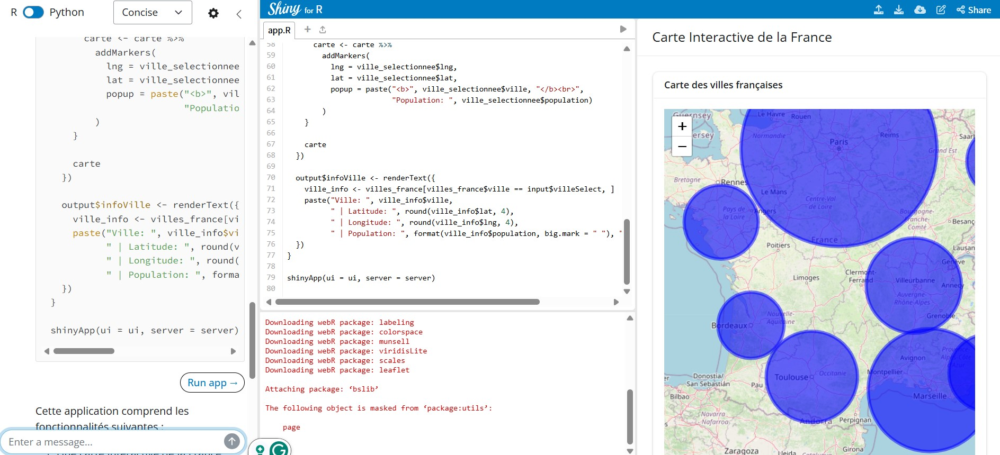

```{r "setup", include=FALSE}
pacman::p_load("shiny")
# knitr::opts_chunk$set(eval = FALSE)
```

## 1 Today's program

-   Introduction to **Shiny app** and interactive interface
-   Shiny basic demonstration

## 2 Today's Learning Objectives

-   List benefits of using Shiny app to create reports
-   Explain how Shiny app is a useful and a funny interactive tool in Open Science
-   Learn Shiny app basics

## 3 Introduction to Shiny app

### 3.1 What is Shiny ?

**Shiny** is an R package that makes it easy to build interactive web apps straight from R. You can host standalone apps on a webpage or embed them in R Markdown documents or build dashboards. You can also extend your Shiny apps with CSS themes, [htmlwidgets](https://www.htmlwidgets.org/), [bslib](https://rstudio.github.io/bslib/index.html), and JavaScript actions.

**Shiny** combines the computational power of R with the interactivity of the modern web and its apps are easy to write.

You can find **Shiny Learning Ressources** to start, explore and enjoy interactive interface computing [here](https://shiny.rstudio.com/tutorial/).

### 3.2 How to start with Shiny ?

In R Studio you can open a `Shiny Web App` file which while allow you to make your own app with **Shiny**. An app that can be manipulate directly by a user. You have also the possibility to create an `RMarkdown` working with Shiny. The rules are the same than in session 4, only the content of the `chunks`will be different and specific to **Shiny app**. To create this Shiny `RMarkdown`, you just have to specify the nature of your document when you create it.

### 3.3 Structure of a Shiny app

::: callout-tip
See the Shiny basics lesson for reference: <https://shiny.posit.co/r/getstarted/shiny-basics/lesson1/>
:::

Shiny apps are contained in a single script called `app.R`. The script `app.R` lives in a directory (for example, `newdir/`) and the app can be run with `runApp("newdir")`.

A **Shiny app** script file has three major components :

1.  **The user interface** (`ui`) object controls the layout and appearance of your app. Basically, it is here where you will provide information about the structure of your html and how user will interact with it.

2.  The **server** function contains the instructions that your computer needs to build your app. This function contain codes and functions that you want to apply in your app.

3.  Finally a call to the `shinyApp` function that creates Shiny app objects from an explicit UI/server pair.

::: callout-note
Prior to version `0.10.2`, Shiny did not support single-file apps and the ui object and server function needed to be contained in separate scripts called ui.R and server.R, respectively. This functionality is still supported in Shiny, however the tutorial and much of the supporting documentation focus on single-file apps.
:::

Below you can find a simple Shiny web application which show you the structure of a Shiny app producing an histogram where you can change the number of bins.

First you describe the **User interface** (`ui`) with a title (`titlePanel`), the sidebar parameters using by the user to change the number of bins(`sidebarLayout`) and the result expected at the end : a plot (`mainPanel`).

```{r, eval = FALSE, echo = TRUE}
library(shiny)

# Define UI for app that draws a histogram ----
ui <- page_sidebar(
    # App title ----
    title = "Hello Shiny!",
    # Sidebar panel for inputs ----
    sidebar = sidebar(
        # Input: Slider for the number of bins ----
        sliderInput(
            inputId = "bins",
            label = "Number of bins:",
            min = 1,
            max = 50,
            value = 30
        )
    ),
    # Output: Histogram ----
    plotOutput(outputId = "distPlot")
)
```

Then you describe the **server function** (`server`) which works like a `function` using *input* and *output* to create your histogram.

```{r, eval = FALSE, echo = TRUE}
# Define server logic required to draw a histogram
server <- function(input, output) {
    output$distPlot <- renderPlot({
        # generate bins based on input$bins from ui.R
        x <- faithful$waiting
        bins <- seq(min(x), max(x), length.out = input$bins + 1)

        # draw the histogram with the specified number of bins
        hist(x,
            breaks = bins, col = "darkgray", border = "white",
            xlab = "Waiting time to next eruption (in mins)",
            main = "Histogram of waiting times"
        )
    })
}
```

Finally you can run the application to create your Shiny web application by using the `shinyApp` function.

```{r, eval = FALSE, echo = TRUE}
# Run the application
shinyApp(ui = ui, server = server)
```

By running this code, you will be able to get the below:

```{r slider, echo = FALSE}
sliderInput("bins", "Number of bins:",
    min = 1, max = 50, value = 30
)
plotOutput("distPlot")
```

```{r, echo = FALSE}
#| context: server
output$distPlot <- renderPlot({
    x <- faithful[, 2] # Old Faithful Geyser data
    bins <- seq(min(x), max(x), length.out = input$bins + 1)
    hist(x, breaks = bins, col = "darkgray", border = "white")
})
```

You can create Shiny apps by copying and modifying existing Shiny apps. The [Shiny gallery](https://shiny.rstudio.com/gallery/) provides some good examples, or use the eleven pre-built Shiny examples listed below.

```{r, eval = FALSE, echo = TRUE}
runExample("01_hello") # a histogram
runExample("02_text") # tables and data frames
runExample("03_reactivity") # a reactive expression
runExample("04_mpg") # global variables
runExample("05_sliders") # slider bars
runExample("06_tabsets") # tabbed panels
runExample("07_widgets") # help text and submit buttons
runExample("08_html") # Shiny app built from HTML
runExample("09_upload") # file upload wizard
runExample("10_download") # file download wizard
runExample("11_timer") # an automated timer
```

Each demonstrates a feature of Shiny apps. All Shiny example apps open in "showcase" mode (with the app.R script in the display).

### 3.4 Other options to make a Shiny app

You can also add **Shiny-style interactivity directly inside a Quarto document** (instead of building a standalone `app.R`). When the document YAML contains `server: shiny`, Quarto starts a Shiny backend and provides the usual reactive objects (`input`, `output`, `session`).

In this setup there are **two contexts**:

-   **Document (UI) context**: regular chunks where you place inputs/outputs (e.g., `selectInput()`, `sliderInput()`, `plotOutput()`).
-   **Shiny server context**: chunks marked with `#| context: server`, where you write reactive logic (e.g., `renderPlot()`, `reactive()`, `observe()`) and assign results to `output$...`.

This differs from a “true” Shiny app (`app.R`), where you must explicitly define a `ui` object, a `server()` function, and then call `shinyApp(ui, server)`.

Below, the UI chunk creates two inputs and a plot placeholder, and the server chunk generates the histogram that updates automatically when inputs change.

```r
inputPanel(
    selectInput("n_breaks",
        label = "Number of bins:",
        choices = c(10, 20, 35, 50), selected = 20
    ),
    sliderInput("bw_adjust",
        label = "Bandwidth adjustment:",
        min = 0.2, max = 2, value = 1, step = 0.2
    )
)
plotOutput("eruptionsPlot")
```

```r
#| context: server
output$eruptionsPlot <- renderPlot({
  hist(
    faithful$eruptions,
    probability = TRUE,
    breaks = as.numeric(input$n_breaks),
    xlab = "Duration (minutes)",
    main = "Geyser eruption duration"
  )

  dens <- density(faithful$eruptions, adjust = input$bw_adjust)
  lines(dens, col = "blue")
})
```

```{r eruptions}
inputPanel(
    selectInput("n_breaks",
        label = "Number of bins:",
        choices = c(10, 20, 35, 50), selected = 20
    ),
    sliderInput("bw_adjust",
        label = "Bandwidth adjustment:",
        min = 0.2, max = 2, value = 1, step = 0.2
    )
)
plotOutput("eruptionsPlot")
```

```{r eruptionsserver}
#| context: server
#| echo: true
output$eruptionsPlot <- renderPlot({
  hist(
    faithful$eruptions,
    probability = TRUE,
    breaks = as.numeric(input$n_breaks),
    xlab = "Duration (minutes)",
    main = "Geyser eruption duration"
  )

  dens <- density(faithful$eruptions, adjust = input$bw_adjust)
  lines(dens, col = "blue")
})
```


In all of R code chunks above you can write `echo = FALSE` if you want to prevent the R code within the chunk from rendering in the document alongside the Shiny components.

### 3.5 Syntax in Shiny app

Shiny UIs are web pages. Instead of writing raw HTML, Shiny provides R functions whose names match common HTML tags (`p`, `div`, `span`, etc.). These functions generate HTML that the browser displays. You can style elements with the `style=` argument using standard CSS.

You can see below code lines, the results of differents syntax parameters into the html of your Shiny Web application.

```{r}
### HTML tags in Shiny: raw code vs output (two columns)

library(shiny)

code_text <- paste(
  'p("p() creates a paragraph of text.")',
  'p("This paragraph is styled with CSS (Times New Roman, 16pt).", style = "font-family: \'Times New Roman\'; font-size: 16pt;")',
  'strong("strong() makes bold text.")',
  'em("em() makes italic text.")',
  'br()',
  'code("code() displays text like code")',
  'div("div() is a block element (this block is blue).", style = "color: blue;")',
  'p("span() is inline: it can style ", span("a few words", style = "color: blue;"), " inside a paragraph.")',
  sep = "\n"
)

fluidPage(
  fluidRow(
    column(
      6,
      h4("1) Raw code"),
      tags$pre(tags$code(code_text))
    ),
    column(
      6,
      h4("2) Output"),
      p("p() creates a paragraph of text."),
      p(
        "This paragraph is styled with CSS (Times New Roman, 16pt).",
        style = "font-family: 'Times New Roman'; font-size: 16pt;"
      ),
      strong("strong() makes bold text."),
      br(),
      em("em() makes italic text."),
      br(),
      code("code() displays text like code"),
      div(
        "div() is a block element (this block is blue).",
        style = "color: blue;"
      ),
      p(
        "span() is inline: it can style ",
        span("a few words", style = "color: blue;"),
        " inside a paragraph."
      )
    )
  )
)
```

## 4 Practical example : Shiny app to compare the effect EPSG choice by country

This **Shiny app** was made to compare projections of a chosen country regarding the *Mercator projection (WGS84)* and a projection that the user can select by changing the projection code.

```{r,warning=FALSE}
# Load packages ----
pacman::p_load(
    shiny, mwshiny, # multiwindow app
    tidyverse,
    rnaturalearth,
    rnaturalearthdata,
    sf,
    lwgeom
)
```

Download the countries by using `ne_countries` function.

```{r, eval = FALSE}
#---- Load data ----
World <- ne_countries(scale = "medium", returnclass = "sf") %>%
    dplyr::filter(type == "Sovereign country" | type == "Country") %>%
    dplyr::arrange(name_long)
```

First you describe the **User interface** (`ui`) with a title (`titlePanel`), the sidebar parameters using by the user to change the country chosen (`selectInput`)and the code of the projection (`numericInput`) and the result expected at the end : a country projection in *Mercator* and in a chosen projection with a comparaison table (`mainPanel`).

```{r, eval = FALSE, echo = TRUE}
#---- GUI- User interface ----
ui <- fluidPage(
    "Comparing the effect EPSG choice on spatial polygons: default EPSG is WGS84 - World Geodetic System 1984 (EPSG: 4326)", # name of the app
    sidebarLayout(
        sidebarPanel(
            selectInput(
                inputId = "Country", label = strong("Selected country"), # Select type of variable to plot
                choices = unique(World$name_long),
                selected = "Australia"
            ),
            numericInput(
                inputId = "EPSG", label = strong("Change EPSG"), # Select type of variable to plot
                value = 3112,
                min = 1024,
                max = 32767,
                step = 1
            )
        ),
        mainPanel(
            plotOutput("EPSG4326"),
            plotOutput("EPSG_User"),
            tableOutput("ComparisonTable")
        )
    )
)
```

Then you describe the **server function** (`server`) which works like a `function` using *input* and *output* to create your plots and comparaison table.

Notice that the input in the server are linked with those in the `UI` ! By example when you subset the chosen country at the beginning you are using `input$Country` which was created in the `UI`. Same things for the outputs !

The function in **Shiny apps** have always the same structure, in the following you can see that your are asking two plots and a table by using `renderPlot`and `renderTable`, the function is the same but you define the kind of output you are waiting for.

```{r, eval = FALSE, echo = TRUE}
server <- function(input, output, session) {
    # Subset data
    myCountries <- reactive({
        World %>%
            filter(
                name_long == input$Country
            )
    })

    # Building the epgs4326 map
    output$EPSG4326 <- renderPlot({ # render function (e.g. renderPlot) in the server function
        ggplot(data = myCountries()) +
            geom_sf(alpha = 0.7) +
            ggtitle("EPSG: 4326") +
            labs(x = "Longitude", y = "Latitude") +
            theme_light()
    })

    # Building the epgsUser map
    output$EPSG_User <- renderPlot({ # render function (e.g. renderPlot) in the server function
        ggplot(data = st_transform(myCountries(), crs = input$EPSG)) +
            geom_sf(fill = "red", alpha = 0.7) +
            ggtitle(paste0("EPSG: ", input$EPSG)) +
            labs(x = "Longitude", y = "Latitude") +
            theme_light()
    })

    # model_output<-eventReactive(input$EPSG,{
    #  test(input$EPSG)
    # })

    # Building the output statistics table
    output$ComparisonTable <- renderTable({
        area4326 <- round(as.numeric(st_area(myCountries())) / 10^6, 1)
        perimeter4326 <- round(as.numeric(st_length(st_cast(myCountries(), to = "MULTILINESTRING"))) / 10^3, 1)
        areaUser <- round(as.numeric(st_area(st_transform(myCountries(), crs = input$EPSG))) / 10^6, 1)
        perimeterUser <- round(as.numeric(st_length(st_cast(st_transform(myCountries(), crs = input$EPSG), to = "MULTILINESTRING"))) / 10^3, 1)
        rc_area <- (areaUser - area4326) / area4326 * 100
        rc_perimeter <- (perimeterUser - perimeter4326) / perimeter4326 * 100

        dplyr::as_tibble(data.frame(
            "Variable" = c("Area (km2)", "Perimeter (km)"),
            "EPSG:4326" = c(area4326, perimeter4326),
            # paste0("EPSG:User",model_output()[[1]])= c(areaUser, perimeterUser ),
            "EPSG:User" = c(areaUser, perimeterUser),
            "Rel.change (%)" = c(round(rc_area, 2), round(rc_perimeter, 2))
        ))
    })
}
```

Finally you can run the application to create your Shiny web application by using the `shinyApp` function. Have fun!

```{r, eval = FALSE, echo = TRUE}
# Run the app
shinyApp(ui, server)
```

```{r, echo = FALSE, eval = TRUE}
pacman::p_load(
    shiny, mwshiny, # multiwindow app
    tidyverse,
    rnaturalearth,
    rnaturalearthdata,
    sf,
    lwgeom
)
World <- rnaturalearth::ne_countries(scale = "medium", returnclass = "sf") %>%
    dplyr::filter(type == "Sovereign country" | type == "Country") %>%
    dplyr::arrange(name_long)

fluidPage(
    "Comparing the effect EPSG choice on spatial polygons: default EPSG is WGS84 - World Geodetic System 1984 (EPSG: 4326)", # name of the app
    sidebarLayout(
        sidebarPanel(
            selectInput(
                inputId = "Country", label = strong("Selected country"), # Select type of variable to plot
                choices = unique(World$name_long),
                selected = "Australia"
            ),
            numericInput(
                inputId = "EPSG", label = strong("Change EPSG"), # Select type of variable to plot
                value = 3112,
                min = 1024,
                max = 32767,
                step = 1
            )
        ),
        mainPanel(
            plotOutput("EPSG4326"),
            plotOutput("EPSG_User"),
            tableOutput("ComparisonTable")
        )
    )
)
```

```{r, echo = FALSE, eval = TRUE}
#| context: server
library(dplyr)
library(sf)
library(ggplot2)
library(leaflet)
library(RColorBrewer)

World <- rnaturalearth::ne_countries(scale = "medium", returnclass = "sf") %>%
    dplyr::filter(type == "Sovereign country" | type == "Country") %>%
    dplyr::arrange(name_long)

# Subset data
myCountries <- reactive({
    World %>%
        filter(
            name_long == input$Country
        )
})

# Building the epgs4326 map
output$EPSG4326 <- renderPlot({ # render function (e.g. renderPlot) in the server function
    ggplot(data = myCountries(), alpha = 0.7) +
        geom_sf() +
        ggtitle("EPSG: 4326") +
        labs(x = "Longitude", y = "Latitude") +
        theme_light()
})

# Building the epgsUser map
output$EPSG_User <- renderPlot({ # render function (e.g. renderPlot) in the server function
    ggplot(data = st_transform(myCountries(), crs = input$EPSG), fill = "red", alpha = 0.7) +
        geom_sf() +
        ggtitle(paste0("EPSG: ", input$EPSG)) +
        labs(x = "Longitude", y = "Latitude", colour = " ") +
        theme_light()
})

# model_output<-eventReactive(input$EPSG,{
#  test(input$EPSG)
# })

# Building the output statistics table
output$ComparisonTable <- renderTable({
    area4326 <- round(as.numeric(st_area(myCountries())) / 10^6, 1)
    perimeter4326 <- round(as.numeric(st_length(st_cast(myCountries(), to = "MULTILINESTRING"))) / 10^3, 1)
    areaUser <- round(as.numeric(st_area(st_transform(myCountries(), crs = input$EPSG))) / 10^6, 1)
    perimeterUser <- round(as.numeric(st_length(st_cast(st_transform(myCountries(), crs = input$EPSG), to = "MULTILINESTRING"))) / 10^3, 1)
    rc_area <- (areaUser - area4326) / area4326 * 100
    rc_perimeter <- (perimeterUser - perimeter4326) / perimeter4326 * 100

    dplyr::as_tibble(data.frame(
        "Variable" = c("Area (km2)", "Perimeter (km)"),
        "EPSG:4326" = c(area4326, perimeter4326),
        # paste0("EPSG:User",model_output()[[1]])= c(areaUser, perimeterUser ),
        "EPSG:User" = c(areaUser, perimeterUser),
        "Rel.change (%)" = c(round(rc_area, 2), round(rc_perimeter, 2))
    ))
})
```

## 5. Using Leaflet in shiny : two examples

Below you can find two examples of `ShinyApp` using `leaflet` in order to create an interactive map where users can switch input and use `leaflet` proprieties to change the scale of analysis.

You can find more information about these functions [here](https://rstudio.github.io/leaflet/articles/shiny.html).

```{r, eval = FALSE, echo = TRUE}
library(shiny)
library(leaflet)

r_colors <- rgb(t(col2rgb(colors()) / 255))
names(r_colors) <- colors()

ui <- fluidPage(
    leafletOutput("mymap"),
    p(),
    actionButton("recalc", "New points")
)

server <- function(input, output, session) {
    points <- eventReactive(input$recalc,
        {
            cbind(rnorm(40) * 2 + 13, rnorm(40) + 48)
        },
        ignoreNULL = FALSE
    )

    output$mymap <- renderLeaflet({
        leaflet() %>%
            addProviderTiles(providers$Stadia.StamenTonerLite,
                options = providerTileOptions(noWrap = TRUE)
            ) %>%
            addMarkers(data = points())
    })
}

shinyApp(ui, server)
```

```{r, eval = TRUE, echo = FALSE}
library(shiny)
library(leaflet)

r_colors <- rgb(t(col2rgb(colors()) / 255))
names(r_colors) <- colors()

fluidPage(
    leafletOutput("mymap"),
    p(),
    actionButton("recalc", "New points")
)
```

```{r, eval = TRUE, echo = FALSE}
#| context: server
library(shiny)
library(dplyr)
library(sf)
library(ggplot2)
library(leaflet)
library(RColorBrewer)
points <- eventReactive(input$recalc,
    {
        cbind(rnorm(40) * 2 + 13, rnorm(40) + 48)
    },
    ignoreNULL = FALSE
)

output$mymap <- renderLeaflet({
    leaflet() %>%
        addProviderTiles(providers$Stadia.StamenTonerLite,
            options = providerTileOptions(noWrap = TRUE)
        ) %>%
        addMarkers(data = points())
})

```

You can also create `ShinyApp` where the model parameters can be changed and not only the input information. For example, here, users are allowed to change the color scheme for the `ShinyApp`.

```{r, echo = TRUE, eval = FALSE}
library(shiny)
library(leaflet)
library(RColorBrewer)

ui <- fluidPage(
  titlePanel("Quakes map"),
  sidebarLayout(
    sidebarPanel(
      sliderInput("range", "Magnitudes",
                  min = min(quakes$mag), max = max(quakes$mag),
                  value = range(quakes$mag), step = 0.1),
      selectInput("colors", "Color Scheme",
                  rownames(subset(brewer.pal.info, category %in% c("seq", "div")))),
      checkboxInput("legend", "Show legend", TRUE)
    ),
    mainPanel(
      leafletOutput("map", height = 550)
    )
  )
)

server <- function(input, output, session) {
    # Reactive expression for the data subsetted to what the user selected
    filteredData <- reactive({
        quakes[quakes$mag >= input$range[1] & quakes$mag <= input$range[2], ]
    })

    # This reactive expression represents the palette function,
    # which changes as the user makes selections in UI.
    colorpal <- reactive({
        colorNumeric(input$colors, quakes$mag)
    })

    output$map <- renderLeaflet({
        # Use leaflet() here, and only include aspects of the map that
        # won't need to change dynamically (at least, not unless the
        # entire map is being torn down and recreated).
        leaflet(quakes) %>%
            addTiles() %>%
            fitBounds(~ min(long), ~ min(lat), ~ max(long), ~ max(lat))
    })

    # Incremental changes to the map (in this case, replacing the
    # circles when a new color is chosen) should be performed in
    # an observer. Each independent set of things that can change
    # should be managed in its own observer.
    observe({
        pal <- colorpal()

        leafletProxy("map", data = filteredData()) %>%
            clearShapes() %>%
            addCircles(
                radius = ~ 10^mag / 10, weight = 1, color = "#777777",
                fillColor = ~ pal(mag), fillOpacity = 0.7, popup = ~ paste(mag)
            )
    })

    # Use a separate observer to recreate the legend as needed.
    observe({
        proxy <- leafletProxy("map", data = quakes)

        # Remove any existing legend, and only if the legend is
        # enabled, create a new one.
        proxy %>% clearControls()
        if (input$legend) {
            pal <- colorpal()
            proxy %>% addLegend(
                position = "bottomright",
                pal = pal, values = ~mag
            )
        }
    })
}

shinyApp(ui, server)
```

```{r, eval = TRUE, echo = FALSE}
library(shiny)
library(dplyr)
library(sf)
library(ggplot2)
library(leaflet)
library(RColorBrewer)
fluidPage(
  titlePanel("Quakes map"),
  sidebarLayout(
    sidebarPanel(
      sliderInput("range", "Magnitudes",
                  min = min(quakes$mag), max = max(quakes$mag),
                  value = range(quakes$mag), step = 0.1),
      selectInput("colors", "Color Scheme",
                  rownames(subset(brewer.pal.info, category %in% c("seq", "div")))),
      checkboxInput("legend", "Show legend", TRUE)
    ),
    mainPanel(
      leafletOutput("map", height = 550)
    )
  )
)
```

```{r, eval = TRUE, echo = FALSE}
#| context: server
library(shiny)
library(dplyr)
library(sf)
library(ggplot2)
library(leaflet)
library(RColorBrewer)

# Reactive expression for the data subsetted to what the user selected
filteredData <- reactive({
    quakes[quakes$mag >= input$range[1] & quakes$mag <= input$range[2], ]
})

# This reactive expression represents the palette function,
# which changes as the user makes selections in UI.
colorpal <- reactive({
    colorNumeric(input$colors, quakes$mag)
})

output$map <- renderLeaflet({
    # Use leaflet() here, and only include aspects of the map that
    # won't need to change dynamically (at least, not unless the
    # entire map is being torn down and recreated).
    leaflet(quakes) %>%
        addTiles() %>%
        fitBounds(~ min(long), ~ min(lat), ~ max(long), ~ max(lat))
})

# Incremental changes to the map (in this case, replacing the
# circles when a new color is chosen) should be performed in
# an observer. Each independent set of things that can change
# should be managed in its own observer.
observe({
    pal <- colorpal()

    leafletProxy("map", data = filteredData()) %>%
        clearShapes() %>%
        addCircles(
            radius = ~ 10^mag / 10, weight = 1, color = "#777777",
            fillColor = ~ pal(mag), fillOpacity = 0.7, popup = ~ paste(mag)
        )
})

# Use a separate observer to recreate the legend as needed.
observe({
    proxy <- leafletProxy("map", data = quakes)

    # Remove any existing legend, and only if the legend is
    # enabled, create a new one.
    proxy %>% clearControls()
    if (input$legend) {
        pal <- colorpal()
        proxy %>% addLegend(
            position = "bottomright",
            pal = pal, values = ~mag
        )
    }
})
```

There are plenty of possibility and you can find others examples in this [ShinyApp](https://shiny.posit.co/r/gallery/interactive-visualizations/superzip-example/) or [here](https://www.r-rse.eu/portfolio/shiny-apps/) and on this tutorial website [How to work in Shiny](https://www.paulamoraga.com/book-geospatial/sec-shinyexample.html).

For example, you can make a `ShinyApp` using `leaflet` to provide access, selection, summarising and visualisation of raster maps of the north-west European Shelf sedimentary environment. This is the purpose of the [sedMaps App](https://sheffield-university.shinyapps.io/sedmap_shiny/) made by the University of Sheffield.


## 6. The future is now : Shiny Assistant

Have you ever dream about doing a code just by asking what you want ? Put your fingers in the sand and drink Virgin Mojito while a computer is performing your task. This is now possible by using **Shiny Assistant** You can learn the basic of it [here](https://shiny.posit.co/blog/posts/shiny-assistant/) and try it by yourself directly in [Shiny app](https://gallery.shinyapps.io/assistant/?_gl=1*95qn5j*_ga*MTY1NzI5NjIyMC4xNzM3MDM3ODM4*_ga_2C0WZ1JHG0*MTc0MTY4MzgyNC4zLjEuMTc0MTY4Mzg1MC4wLjAuMA..).

**Shiny Assistant** is a new AI-powered tool that helps you get things done: you can ask it questions about Shiny, or to create a Shiny application from scratch, or ask it to make changes to an existing application. You can think of it as a knowledgeable colleague who is always ready to help with your Shiny projects, in R and Python.

Just ask what you want, discuss with the IA and try to make something interesting, you can follow the example here, where I ask to make a simple map.



However,I want to remind you that using **IA** is not free! Indeed, generating and processing through ChatGPT and other IA generators is a huge carbon emission source today. You can read more about it in [Vilain ChatGPT Vilain](https://www.intelligence-artificielle-school.com/actualite/bilan-carbone-de-l-intelligence-artificielle-analyse-et-axes-d-amelioration/). I am not telling you to not use it, just do it smartly and cautiously, learn with it and then do it by yourself, it will be better for you and the planet.

::: assignment
## Assignment

Today you learn about **Shiny app** and you progressively start to have ideas about your personal project, for next week :

1.  Define clearly what is your subject and make a workflow that you will use for your project. **!!! It must be done in order to start quickly your project !**

-   What is the subject ?

-   What is the objective ? What do you want to do and why ?

-   With which data, packages, functions will you work?

    What are the different steps you will make to reach your goals? E.g.

    :   *I will create a function to calculate land use change in Belgium over the years, so first I will create a function to estimate land use, each years then make a loop to estimate the difference ...*

2.  Play with the several **Shiny apps** in the Teams folders of session 5, change parameters and get used to the syntax and the structure of a **Shiny app**. Then try to create a `shiny.app` presenting the current suitbility map in a `leaflet` environment for a giving country and species. This map will allow the user to make several choices :
    1.  Choice of the country
    2.  Choice of the species
:::